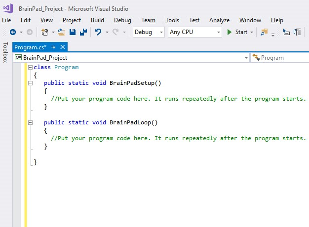

# Introduction to the BrainPad 

## Overview 
Students will learn how to create projects in Visual Studio along with programming basics. Applications in this lesson will be limited to the `BrainPad` object, `If` statements, a `While` loop and the template functions.

## Guidelines 
* Prerequisites: None
* Ages 12 and up
* PC setup with Visual Studio 2017, TinyCLR OS and Nuget packages installed. 
* Supplies: BrainPad and microUSB cable.

## Install Visual Studio and Download .vsix file
Install Visual Studio Community 2017. Select the Community download. Skip this step if you have Visual Studio 2017 installed.

* [Visual Studio 2017 Download](https://www.visualstudio.com/downloads/)

## Starting a New Project
Connect your BrainPad to your computer using a microUSB cable.

Next Open Visual Studio select `File > New > Project` and under Other Languages select `Visual C# > TinyCLR` and choose the `BrainPad Application`. Change the Location to  `C:\Users\<YourUsername>\Desktop\` then name the project `BrainPad_Project`.


From Visual Studio, select File > New > Project:

 

Once created, you'll be presented with a `Program.cs` tab.

  

This file contains the default code when you first create a project. The lines in green that begin with `'` are called comments, and they generally describe what the code does. Take a moment to review them.

Let's run the code to see these comments' descriptions come to life. Connect the BrainPad and press the `F5` function key or the Start button.
 


Visual Studio will now run the code, a few things will happen and the display will now have the text `"Hello, world!"`.


This file contains the default code when you first create a project. The lines in green that begin with `//` are called comments, they generally describe what the code does. 
Take a moment to review them. You can create your own comments in the code by typing `//` before any notes you like to add. Comments don’t affect how your program runs. 
Comments are a great place to keep notes about how a piece of code might work. They are helpful if another programmer looks at your code, or you return to look at your own code at a later date, to help you understand what the code is doing behind the scenes. 


## The BrainPad Object
The world around us is full of objects. Every person, table or circuit board is an object. If we were to ask a person to say “hello,” we'd be asking an object to perform a task. The same concept can be applied to code. Like in the previous application we ran, the BrainPad was asked to control the display through the BrainPad object.
The BrainPad object itself, is a piece of code that is contained in one file. This was developed by GHI Electronics to cover the internals of the BrainPad. This enables students like you, with an easy way to control the BrainPad circuit board.
After typing BrainPad, press the period key to get a list of all available options (Figure 3) for this object, like LightBulb.


Now we can use the arrow keys to go up and down in the list to find the LightBulb, and then press the period key again to see what options (Figure 4) are the available for the LightBulb.


Visual Studio does a great deal of simplifying the programming process by automatically listing available options for an object. They call this neat option built into Visual Studio, _IntelliSense_
Now that we know how to use the `BrainPad` object, let’s learn about controlling the LightBulb.

## The BrainPad LightBulb
LED lights are used in many different electronic devices. Here we will test the LightBulb by turning it green, then ON and OFF. 
Copy and paste the code from Example 1 into your project’s `BrainPadSetup()`, between its two curly braces { }. 

> [!Tip]
> PARENTHESES `( )` and CURLY BRACES `{ }` are used differently, do not confuse them?

```
BrainPad.LightBulb.TurnOff();
BrainPad.LightBulb.TurnGreen();
BrainPad.LightBulb.TurnOff();
BrainPad.LightBulb.TurnGreen();
```
Now, press `F5` to run the code and you’ll see the LightBulb turn green come on and stay on. This happens because our code is executed faster than we can see. So we never see the LightBulb actually blink.

## Problem Solving
Since applications execute extremely fast, we need to slow them down to figure out the problem. This way we can see what is happening or if the results are as expected. We will start by running the code one line at a time, this is called stepping in code to see what the application does at a slow speed.

## Stepping in Code
