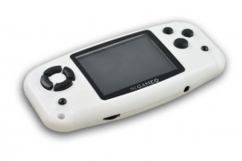

# FEZ Cerberus
---

FEZ Cerberus is a .NET Gadgeteer product that utilizes .NET Micro Framework (NETMF). The core of the FEZ Cerberus is the G30 System on Chip (SoC).

FEZ Cerberus is the mother of the Cerb Family!

To use with NETMF/Gadgeteer, follow these [setup instructions](../../software/netmf/getting-started.md).

## Resources
* [Schematic](http://files.ghielectronics.com/downloads/Schematics/FEZ/FEZ%20Cerberus%20Schematic.pdf)

## Using TinyCLR OS
An [unsupported port](https://github.com/ghi-electronics/TinyCLR-Ports) is provided as a starting point for experimenting with TinyCLR OS. 

Once a firmware is built, the following instructions describe how to set up your board to work with TinyCLR OS. To learn more about TinyCLR OS check out the [TinyCLR Introduction](../../software/tinyclr/intro.md) page.

## The Boot Pins
PB10 is the MODE pin, which is used to select between USB and serial interfaces for bootloader and firmware. USART1 (PB6 and PB7) is used when in serial mode.
LDR0 and LDR1 are PC1 and PC3 respectively. Setting LDR0 low on power up puts the device into bootloader mode. Setting LDR1 low will execute the firmware but will stop the application from running.

### Loading Bootloader v2
1. Download the [bootloader file](../../software/loaders/ghi-bootloader.md#cerb).
2. Press and hold the BOOT button down while resetting the board. 
3. If there is no BOOT button, there will be shunt-footprint labeled BOOT or LDR. Short the 2 pads with a wire while resetting the board.
4. The system will now detect an ST DFU device.
5. Read more on [uploading DFU files](../../software/loaders/stm32-bootloader.md#uploading-dfu-files) on STM32 microcontrollers.

### Loading the Firmware

> [!Tip]
> First make sure you have bootloader v2 loaded. This needs to be done only once.

To activate bootloader v2, set PC1 pin low.

## FEZ Game-O

A programmable game console based on the FEZ Cerberus that was funded with a successful kickstarter campaign. The FEZ Game-O combine a 320 x 240 color display, 3D accelerometer and audio circuitry within an attractive, ergonomic enclosure.

* [Schematic](http://files.ghielectronics.com/downloads/Schematics/FEZ/FEZ%20GameO%20Schematic.pdf)
