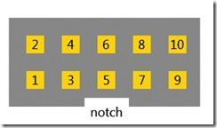

# FEZ Hydra
---

FEZ Hydra is a .NET Gadgeteer product that utilizes .NET Micro Frameworks (NETMF).

To use with NETMF/Gadgeteer, follow these [setup instructions](../../software/netmf/getting-started.md).

## Resources
* [Schematic](http://files.ghielectronics.com/downloads/Schematics/FEZ/FEZ%20Hydra%20Schematic.pdf)

## Using TinyCLR OS
An [unsupported port](https://github.com/ghi-electronics/TinyCLR-Ports) is provided as a starting point for experimenting with TinyCLR OS. 

Once a firmware is built, the following instructions describe how to set up your board to work with TinyCLR OS. To learn more about TinyCLR OS check out the [TinyCLR Introduction](../../software/tinyclr/intro.md) page.

### Loading Bootloader v2
1. Download the [bootloader file](../../software/loaders/ghi-bootloader.md#fez-hydra).
2. Enter SAM-BA mode by connecting SPI1_MISO pin to ground and reset the board. Wait three seconds and remove the connection between SPI1_MISO and ground. SPI1_MISO is pin 8 on socket 3, and ground is pin 10. On later revisions of the board, you can hold down the small button labelled `S1` near the processor instead.  
3. Open up the Device Manager, look under Ports, and find a COM port similar to "Bossa Program Port" or "GPS Detect".
4. Follow the steps for the [SAM-BA bootloader](../../software/loaders/intro.md#sam-ba-bootloader), connecting to the COM port in the previous step. The FEZ Hydra is based on the AT91SAM9RL64-EK. You may get a warning saying that external RAM access is required to run applets. Click yes that you do want to continue anyway.

**Gadgeteer Socket:**

### Loading the Firmware

> [!Tip]
> First make sure you have bootloader v2 loaded. This needs to be done only once.

To activate bootloader v2, hold the LDR0 (socket 3, pin 3) signal low while resetting the board.
