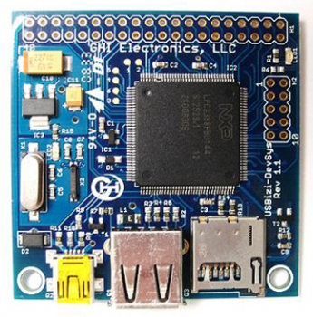
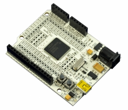
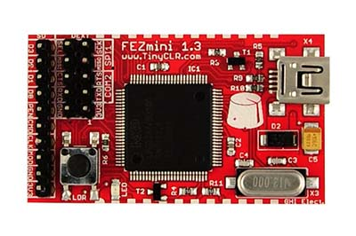

# USBizi
 

USBizi was the first single chip .NET Micro Framework (NETMF) on the market. It was available in 100pin and 144pin LQFP packages.

We are no longer making the chip available but we are making all [bootloader binaries](https://www.ghielectronics.com/downloads/NETMF/USBizi/) (move to new server) available for free, including for commercial use. 

# Resources
* [User Manual](http://files.ghielectronics.com/downloads/Documents/Manuals/USBizi%20User%20Manual.pdf) 

build them and do a quick test to make sure V, N, and X/U workManual.pdf

# Using the NETMF software
We discourage the use of NETMF software on our products in favor for TinyCLR OS, [Read more](intro.md).

# Using TinyCLR OS
If haven't yet, read about using .NET NETMF devices [with TinyCLR OS](intro.md#with-tinyclr-os)

## Loading Bootloader v2
> [!Tip]
> The instructions apply to all USBizi-based boards but we are using the FEZ Panda II as reference.

We first need to erase the old bootloader v1:
1. Connect UART0 TX/RX to your PC. The easiest way would be to use a USB-Serial TTL cable. Those are D0 and D1 on FEZ Panda II. Do not forget to connect the ground.
2. Put the device in serial mode by connecting MOD pin to ground.
3. Open a terminal software and set the baudrate to 115200.
4. Press the enter key and you should see `BL` coming back.
5. Enter this exact line `Unlock This device!` (case sensitive). Ignore the `BL` keeps coming back with every key press. If you entered it correctly, you will see `Are you sure?`
6. Enter `Yes` (case sensitive).
7. You now have a blank LPC chip! You can now close the terminal software, release MOD pin, and reset your board.

The new bootloader v2 can now be loaded.
1. Download and install [Flash Magic](http://www.flashmagictool.com).
2. Open Flash Magic and select LPC2378.
3. Check "Erase all Flash".
4. Set the correct COM port number of your serial connection.
5. Click the `Start` button.
6. When done, reset the board and the PC will detect a virtual USB device.

## Loading the Firmware

> [!Tip]
> First make sure you have bootloader v2 loaded. This needs to be done only once.

To activate bootloader v2, set LDR pin low. On FEZ Panda II  it is a button marked LDR. Simply press it. Once the LDR pin is set low, keep it low while resetting the board.

Download the [USBizi firmware](../../../software/tinyclr/downloads.md#usbizi) and follow [Loading the Firmware](../../../software/tinyclr/loaders/ghi_bootloader.md#loading-the-firmware) steps.

# USBizi Based products
## USBizi DevSys

The original development board for USBizi.

* [Schematic](http://files.ghielectronics.com/downloads/Schematics/USBizi%20DevSys%20Schematic.pdf)

## FEZ Panda

An Arduino-poinout compatible board.

* [Schematic](http://files.ghielectronics.com/downloads/Schematics/FEZ/FEZ%20Panda%20Schematic.pdf)

## FEZ Panda II

An Arduino-poinout compatible board.

* [Schematic](http://files.ghielectronics.com/downloads/Schematics/FEZ/FEZ%20Panda%20II%20Schematic.pdf)

## FEZ Rhino

* [Schematic](http://files.ghielectronics.com/downloads/Schematics/FEZ/FEZ%20Rhino%20Schematic.pdf)

## FEZ Domino

* [Schematic](http://files.ghielectronics.com/downloads/Schematics/FEZ/FEZ%20Domino%20Schematic.pdf)

## FEZ Mini

* [Schematic](http://files.ghielectronics.com/downloads/Schematics/FEZ/FEZ%20Mini%20Schematic.pdf)
