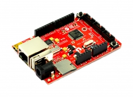
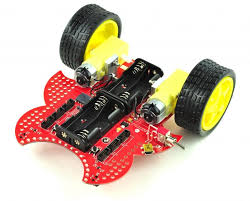

# FEZ Cerberus

FEZ Cerberus is a .NET Gadgeteer product that utilizes .NET Micro Frameworks (NETMF). The core of FEZ Cerberus is the G30 System on Chip (SoC).

FEZ Cerberus is the mother of [the Cerb Family]().

# Resources
* [Schematic](http://files.ghielectronics.com/downloads/Schematics/FEZ/FEZ%20Cerberus%20Schematic.pdf)

# Using the Gadgeteer software
We discourage the use of NETMF and Gadgeteer software technologies on our products in favor for TinyCLR OS. [Read more](intro.md) about the use of NETMF, Gadgeteer and TinyCLR OS.

# Using TinyCLR OS
If haven't yet, read about using .NET Gadgeteer devices [with TinyCLR OS](intro.md#with-tinyclr-os)

## Loading Bootloader v2
1. Download the [bootloader file](../../loaders/ghi_bootloader.md#cerb)
2. Press and hold BOOT button down while resetting the board. 
3. If there is no BOOT button, there will be shunt-footprint labeled BOOT or LDR. Short the 2 pads with a wire while resetting the board.
4. The system will now detect an ST DFU device.
5. Read more on [uploading DFU files](/hardware/loaders/stm32_bootloader.md#uploading-dfu-files) on STM32 microcontrollers.

## Loading the Firmware

> [!Tip]
> First make sure you have bootloader v2 loaded. This needs to be done only once.

To activate bootloader v2, set PA15 pin low.

Download the [Cerb firmware](../../../tinyclr/downloads.md#cerb) and follow [Loading the Firmware](../../loaders/ghi_bootloader.md#loading-the-firmware) steps.

# The Cerb Family
The FEZ Cerberus come in different form factor, together called the Cerb family. The entire family run the same software.

## FEZ Cerberus
 

The mother of the family!

## FEZ Cerbuino Bee
 

An Arduino-pinout compatible for accepting shields and also has some Gadgeteer socket option.

* [Schematic](http://files.ghielectronics.com/downloads/Schematics/FEZ/FEZ%20Cerbuino%20BeeSchematic%20.pdf)

## FEZ Cerbuino Net

An Arduino-pinout compatible for accepting shields and also has some Gadgeteer socket option.

* [Schematic](http://files.ghielectronics.com/downloads/Schematics/FEZ/FEZ%20Cerbuino%20Net%20Schematic.pdf)

## FEZ Cerb40

DIP40 formfactor board. Not really a Gadgeteer board but it is very small!

* [Schematic](http://files.ghielectronics.com/downloads/Schematics/FEZ/FEZ%20Cerb40%20Schematic.pdf)

## FEZ Cerbot

A robot with reflective sensors and tons of LEDs. Gadgeteer sockets are used as an easy way to add features.

* [Schematic](http://files.ghielectronics.com/downloads/Schematics/FEZ/FEZ%20Cerbot%20Schematic.pdf)

## FEZ Game-O

A programmable console combined with a 320 x 240 color display, 3D accelerometer and audio circuitry.

* [Schematic](http://files.ghielectronics.com/downloads/Schematics/FEZ/FEZ%20GameO%20Schematic.pdf)
