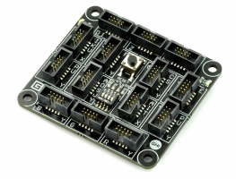

# FEZ Spider

FEZ Spider is a .NET Gadgeteer product, that utilizes .NET Micro Frameworks (NETMF). The core of FEZ Spider is the EMX System on Module (SoM).

# Resources
* [Schematics (add it)]()

# Using the Gadgeteer software
We discourage the use of NETMF and Gadgeteer software technologies on our products in favor for TinyCLR OS. [Read more](intro.md) about the use of NETMF, Gadgeteer and TinyCLR OS.

# Using TinyCLR OS
If haven't yet, read about using .NET Gadgeteer devices [with TinyCLR OS](intro.md#with-tinyclr-os)

## Loading Bootloader Version 2
> [!Tip]
> The EMX bootloader version 1 doesn't always work with Windows 7 and newer (Error code 10). You can use the serial option to update the loader.
> This is a one-time procedure. You should have no issues after the bootloader V2 is loaded.

**To update using USB**
1. Download the [bootloader file](http://files.ghielectronics.com/downloads/Bootloaders/EMX%20Bootloader.2.0.3.ghi)
2. Set the board's configuration switches in boot mode. That is by setting switches #1, #2 and #3 to the on position.
3. Connect the FEZ Spider to a power module (red module) and then to a PC.
4. The PC will now detect a virtual serial (COM) device. If you need drivers, they are in the [NETMF](../netmf/intro.md) SDK.
5. Open any terminal software, we recommend [Tera Term](http://ttssh2.osdn.jp/).
6. Select serial and pick the COM port associated with your board.
7. Enter `E` and you will see back "Erase all memory! Are you sure?" now enter `Y`. (The bootloader is case sensitive)
8. Enter `X` and you will see `CCCC`... showing on the terminal.
9. Now go to `File` -> `Transfer` -> `XMODEM` -> `Send` and then check the `1K` option.
10. Select the bootloader file you have downloaded above.
11. You will see `File Transfer Finished Successfully`.
12. Change the configuration switches back to the off position and reset the board.
13. You are now running GHI Electronics bootloader version 2!

**To update using Serial**
1. Connect a USB-serial module to socket 11.
2. Follow the exact same steps above except you need to also switch #4 to on (serial mode)
3. The drivers for the USB-serial module should load automatically. If not, get them from http://www.ftdichip.com/

## Loading the Firmware

> [!Tip]
> First make sure you have bootloader Version 2 loaded. This needs to be done only once.

To activate bootloader version 2, set the configuration switch #1 (double check) to the on position and then reset your board.

Download the  [EMX firmware](../../../tinyclr/downloads.md#emx) and folow [Loading the Firmware](intro.md#loading-the-firmware) steps.
