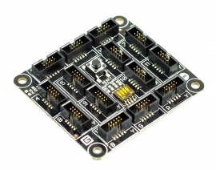

# FEZ Spider II



FEZ Spider II is a .NET Gadgeteer product.


> [!Tip]
> The use of the original NETMF and Gadgeteer software is discouraged. [Read more](intro.html).

# Using TinyCLR OS

First step is to load a secondary bootloader and the TinyCLR OS firmware.


> [!Tip]
> The core of the FEZ Spider II is the G120E System on Module (SoM)

## Updating the Bootloader

First, we need GHI Electronics' [bootloader](../../loaders/bootloader.html) version 2.

1. Set the board's configuration switches in boot mode. That is by setting switches #1 and #2 to the on position.
2. Connect the FEZ Spider II to a power module (red module) and then to a PC.
3. The PC will now detect a virtual serial (COM) device. If you need drivers, they are in the [NETMF](../netmf/intro.html) SDK.
4. Open any terminal software, we recommend [Tera Term](http://ttssh2.osdn.jp/).
5. Select serial and pick the COM port associated with your board.
6. Enter `E` and you will see back "Erase all memory! Are you sure?" now enter `Y`. (The bootloader is case sensitive)
7. Enter `X` and you will see `CCCC`... showing on the terminal.
8. Now go to `File` -> `Transfer` -> `XMODEM` -> `Send` and then check the `1K` option.
9. Select the `G120 Bootloader v203.ghi` file. You can find available downloads here
10. You will see `File Transfer Finished Successfully`.
11. Change the configuration switches back to the off position and reset the board.
12. You are now running GHI Electronics bootloader version 2!

## Loading the TinyCLR OS firmware

1. Close Tera Term (if it is still open) and reopen it.
2. Press `V` and then enter. You will see back the boot loader version number (v2.0.3)
3. Press `U` and then enter, then `Y` and then enter. You will now see `CCCC`...
4. Now you can transfer the firmware file, just like you transferred the bootloader before. Go to `File` -> `Transfer` -> `XMODEM` -> `Send` and then check the `1K` option.
5. Select the `G120 Frimware.xxx.glb` firmware file. (from where?)
6. When the transfer is complete, reset your board. You are now ready to use TinyCLR OS.


> [!Tip]
> You no longer need to update the bootloader. Next time you need to update the firmware, set switch ??? to on and then folow the same steps to update the firmware only.

 # Blinking the LED

> [!Tip]
> If you have never used TinyCLR OS before, [start here]( http://docs.ghielectronics.com/tinyclr/tutorials/intro.html)

This example will blink the debug LED. You only need to add a power module to your mainboard.

```
using System.Threading;
using GHIElectronics.TinyCLR.Devices.Gpio;
using GHIElectronics.TinyCLR.Pins;

class Program {
    static void Main() {
        var led = GpioController.GetDefault().OpenPin(FezSpider.GpioPin.DebugLed);
        led.SetDriveMode(GpioPinDriveMode.Output);

        while(true) {
            led.Write(GpioPinValue.High);
            Thread.Sleep(200);
            led.Write(GpioPinValue.Low);
            Thread.Sleep(200);
        }
    }
}
```

> [!Tip]
> The complete pin mapping is made available for TinyCLR OS. You should not need to use any schematics.

# Adding .NET Gadgeteer Modules
You are now ready to start with [Modules](modules.html).
