# .NET Gadgeteer Modules
This page lists all .NET Gadgeteer modules and how they can be used with [TinyCLR OS](../../../tinyclr/intro.md). If you are planning on using the old NETMF/Gadgeteer software, which we discourage,  then read the [.NET Gadgeteer Intro](intro.md) page.

> [!Tip]
> You can use Intellisense with the pin definition class to quickly determine where things go.
> For example: Typing `FEZSpider.GpioPin.Socket4.` lists the available GPIO pins on socket 4
> Another example: Typing `FEZSpider.UartPort.` lists all available UART sockets (that is "U" in the old Gadgeteer standard)

> [!Tip]
> We will be using the original, and most popular, FEZ Spider as a base for this page but any other mainboard will work very similarly.


# Accel G248
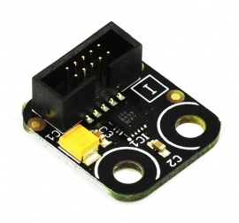

The Accel G248 measures acceleration though I2C bus. Use the [original Gadgteer driver](https://github.com/ghi-electronics/NETMF-Gadgeteer/blob/master/Modules/GHIElectronics/AccelG248) as a reference.
* [Schematic](http://files.ghielectronics.com/downloads/Schematics/Gadgeteer/Accel%20G248%20Module%20Schematic.pdf)

# Barometer


Measures pressure. Use the [original Gadgteer driver](https://github.com/ghi-electronics/NETMF-Gadgeteer/tree/master/Modules/GHIElectronics/Barometer) as a reference.
* [Schematic](http://files.ghielectronics.com/downloads/Schematics/Gadgeteer/Barometer%20Module%20Schematic.pdf)

# Bluetooth


Use the [original Gadgteer driver](https://github.com/ghi-electronics/NETMF-Gadgeteer/tree/master/Modules/GHIElectronics/Bluetooth) as a reference.
* [Schematic](http://files.ghielectronics.com/downloads/Schematics/Gadgeteer/Bluetooth%20Module%20Schematic.pdf)

# Breadboard X1


An easy breadboard option. Simply access the socket directly to wire whatever your heart desires!
* [Schematic](http://files.ghielectronics.com/downloads/Schematics/Gadgeteer/BreadBoard%20X1%20Module%20Schematic.pdf)

# Breakout
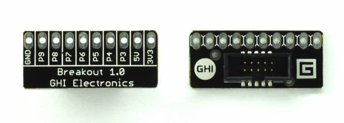

Simply a breakout of all signals.
* [Schematic](http://files.ghielectronics.com/downloads/Schematics/Gadgeteer/Breakout%20Module%20Schematic.pdf)

# Breakout TB10


Simply a breakout of all signals, on a terminal block.
* [Schematic](http://files.ghielectronics.com/downloads/Schematics/Gadgeteer/Breakout%20TB10%20Module%20Schematic.pdf)

# Button
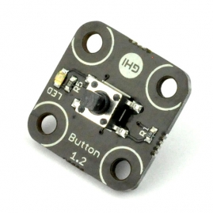

The Button module is very simple, with a button connected to pin 3 and an LED connected to pin4.

This example will blink the LED at different rates, depending on the button press.
```
using System.Threading;
using GHIElectronics.TinyCLR.Devices.Gpio;
using GHIElectronics.TinyCLR.Pins;

class Program {
    static void Main() { 
        var LED = GpioController.GetDefault().OpenPin(FEZSpider.GpioPin.Socket4.Pin3);
        LED.SetDriveMode(GpioPinDriveMode.Output);

        var Button = GpioController.GetDefault().OpenPin(FEZSpider.GpioPin.Socket4.Pin4);
        Button.SetDriveMode(GpioPinDriveMode.InputPullUp);
        var speed = 200;
        while (true) {
            if (Button.Read() == GpioPinValue.High)
                speed = 200;// high = button is not pressed
            else
                speed = 500;// low = button is pressed

            // blink the LED
            LED.Write(GpioPinValue.High);
            Thread.Sleep(speed);
            LED.Write(GpioPinValue.Low);
            Thread.Sleep(speed);
        }
    }
}
```
* [Schematic](http://files.ghielectronics.com/downloads/Schematics/Gadgeteer/Button%20Module%20Schematic.pdf)

# Button S7


7 buttons on a single module, with LEDs that light up with button presses! 

Use the same code example provided for the Button Module.

Buttons map:
* Left: Pin  
* Right: Pin 8
* Up: Pin 6
* Down: Pin 7
* Enter: Pin 3
* Back: Pin 4
* Forward: Pin 9

* [Schematic](http://files.ghielectronics.com/downloads/Schematics/Gadgeteer/Button%20s7%20Module%20Schematic.pdf)

# CAN DW


CAN is not yet supported in TinyCLR OS, you can add it if you are up for a challenge!
* [Schematic](http://files.ghielectronics.com/downloads/Schematics/Gadgeteer/CANDW%20Module%20Schematic.pdf)

# Camera


USB Host is not supported in TinyCLR OS
* [Schematic](http://files.ghielectronics.com/downloads/Schematics/Gadgeteer/Camera%20Module%20Schematic.pdf)

# Cellular Radio


Use the [original Gadgteer driver](https://github.com/ghi-electronics/NETMF-Gadgeteer/tree/master/Modules/GHIElectronics/CellularRadio) as a reference.
* [Schematic](http://files.ghielectronics.com/downloads/Schematics/Gadgeteer/Cellular%20Radio%20Module%20Schematic.pdf)

# Character Display


This is a standard and very common HD44780 display.

Use the [original Gadgteer driver](https://github.com/ghi-electronics/NETMF-Gadgeteer/blob/master/Modules/GHIElectronics/CharacterDisplay) as a reference.
* [Schematic](http://files.ghielectronics.com/downloads/Schematics/Gadgeteer/Character%20Display%20Module%20Schematic.pdf)

# ColorSense


A color sensor that uses software I2C, not yet supported in TinyCLR OS.

Use the [original Gadgteer driver](https://github.com/ghi-electronics/NETMF-Gadgeteer/blob/master/Modules/GHIElectronics/ColorSense) as a reference.
* [Schematic](http://files.ghielectronics.com/downloads/Schematics/Gadgeteer/Color%20Sense%20Module%20Schematic.pdf)

# Compass


Use the [original Gadgteer driver](https://github.com/ghi-electronics/NETMF-Gadgeteer/tree/master/Modules/GHIElectronics/Compass) as a reference.
* [Schematic](http://files.ghielectronics.com/downloads/Schematics/Gadgeteer/Compass%20Module%20Schematic.pdf)

# Current ACS712


This is a current sensor that uses ACS712, which simply outputs an analog voltage.

Use the [original Gadgteer driver](https://github.com/ghi-electronics/NETMF-Gadgeteer/tree/master/Modules/GHIElectronics/CurrentACS712) as a reference.
* [Schematic](http://files.ghielectronics.com/downloads/Schematics/Gadgeteer/Current%20ACS712%20Module%20Schematic.pdf)

# Display CP7


Read more about the [display support](../../../tinyclr/tutorials/display.md) on TinyCLR OS.
The configurations for the display:
```
// these are the wrong values!
Width = 800,
Height = 480,
PixelClockRate = 24 * 1000 * 1000,
PixelPolarity = false,
OutputEnablePolarity = true,
OutputEnableIsFixed = true,
HorizontalFrontPorch = 16,
HorizontalBackPorch = 46,
HorizontalSyncPulseWidth = 1,
HorizontalSyncPolarity = true,
VerticalFrontPorch = 7,
VerticalBackPorch = 23,
VerticalSyncPulseWidth = 1,
VerticalSyncPolarity = true,
```
* [Schematic](http://files.ghielectronics.com/downloads/Schematics/Gadgeteer/Display%20CP7%20Module%20Schematic.pdf)

# Display N18
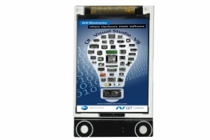

This is an SPI display that can work on any system with SPI bus, even small ones without TFT display support.
See the [Display](../../../tinyclr/tutorials/display.md) tutorial for more details.
* [Schematic](http://files.ghielectronics.com/downloads/Schematics/Gadgeteer/Display%20N18%20Module%20Schematic.pdf)

# Display N7
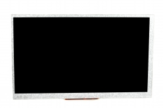

Read more about the [display support](../../../tinyclr/tutorials/display.md) on TinyCLR OS.
The configurations for the display:
```
Width = 800,
Height = 480,
PixelClockRate = 24 * 1000 * 1000,
PixelPolarity = false,
OutputEnablePolarity = true,
OutputEnableIsFixed = true,
HorizontalFrontPorch = 16,
HorizontalBackPorch = 46,
HorizontalSyncPulseWidth = 1,
HorizontalSyncPolarity = true,
VerticalFrontPorch = 7,
VerticalBackPorch = 23,
VerticalSyncPulseWidth = 1,
VerticalSyncPolarity = true,
```
* [Schematic](http://files.ghielectronics.com/downloads/Schematics/Gadgeteer/Display%20N7%20Module%20Schematic.pdf)

# Display NHVN


This allows the use of several displays offered by http://newhavendisplay.com/

Supported displays:
* [NHD-4.3-480272EF-ATXL#](http://www.newhavendisplay.com/nhd43480272efatxl-p-5570.html)
* [NHD-4.3-480272EF-ATXL#-CTP](http://www.newhavendisplay.com/nhd43480272efatxlctp-p-5572.html)
* [NHD-4.3-480272EF-ATXL#-T](http://www.newhavendisplay.com/nhd43480272efatxlt-p-5571.html)
* [NHD-7.0-800480EF-ATXL#](http://www.newhavendisplay.com/nhd70800480efatxl-p-6284.html)
* [NHD-7.0-800480EF-ATXL#-CTP](http://www.newhavendisplay.com/nhd70800480efatxlctp-p-6911.html)
* [NHD-7.0-800480EF-ATXV#](http://www.newhavendisplay.com/nhd70800480efatxv-p-6720.html)
* [NHD-7.0-800480EF-ATXV#-CTP](http://www.newhavendisplay.com/nhd70800480efatxvctp-p-6912.html)

Read more about the [display support](../../../tinyclr/tutorials/display.md) on TinyCLR OS.

The configurations for all 4.3" display:
```
Width = 480,
Height = 272,
PixelClockRate = 20 * 1000 * 1000,
PixelPolarity = false,
OutputEnablePolarity = true,
OutputEnableIsFixed = false,
HorizontalFrontPorch = 2,
HorizontalBackPorch = 2,
HorizontalSyncPulseWidth = 41,
HorizontalSyncPolarity = false,
VerticalFrontPorch = 2,
VerticalBackPorch = 2,
VerticalSyncPulseWidth = 10,
VerticalSyncPolarity = false,
```

The configurations for all 7" display:
```
Width = 800,
Height = 480,
PixelClockRate = 20 * 1000 * 1000,
PixelPolarity = false,
OutputEnablePolarity = true,
OutputEnableIsFixed = false,
HorizontalFrontPorch = 88,
HorizontalBackPorch = 40,
HorizontalSyncPulseWidth = 48,
HorizontalSyncPolarity = false,
VerticalFrontPorch = 13,
VerticalBackPorch = 32,
VerticalSyncPulseWidth = 3,
VerticalSyncPolarity = false,
```
As for the capacitive touch controller, use this [old NETMF driver](https://old.ghielectronics.com/docs/338/display-nhvn-developers-guide) as a reference.
* [Schematic](http://files.ghielectronics.com/downloads/Schematics/Gadgeteer/Display%20NHVN%20Module%20Schematic.pdf)

# Display T35


Read more about the [display support](../../../tinyclr/tutorials/display.md) on TinyCLR OS.
The configurations for the display:
```
Width = 320,
Height = 240,
PixelClockRate = 15 * 1000 * 1000,
PixelPolarity = false,
OutputEnablePolarity = true,
OutputEnableIsFixed = true,
HorizontalFrontPorch = 51,
HorizontalBackPorch = 27,
HorizontalSyncPulseWidth = 41,
HorizontalSyncPolarity = false,
VerticalFrontPorch = 16,
VerticalBackPorch = 8,
VerticalSyncPulseWidth = 10,
VerticalSyncPolarity = false,
```
* [Schematic](http://files.ghielectronics.com/downloads/Schematics/Gadgeteer/Display%20T35%20Module%20Schematic.pdf)

# Display T43
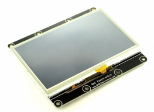

Read more about the [display support](../../../tinyclr/tutorials/display.md) on TinyCLR OS.
The configurations for the display:
```
Width = 480,
Height = 272,
PixelClockRate = 20 * 1000 * 1000,
PixelPolarity = false,
OutputEnablePolarity = true,
OutputEnableIsFixed = false,
HorizontalFrontPorch = 2,
HorizontalBackPorch = 2,
HorizontalSyncPulseWidth = 41,
HorizontalSyncPolarity = false,
VerticalFrontPorch = 2,
VerticalBackPorch = 2,
VerticalSyncPulseWidth = 10,
VerticalSyncPolarity = false,
```
* [Schematic](http://files.ghielectronics.com/downloads/Schematics/Gadgeteer/Display%20T43%20Module%20Schematic.pdf)

# Display TE35


Read more about the [display support](../../../tinyclr/tutorials/display.md) on TinyCLR OS.
The configurations for the display:
```
Width = 320,
Height = 240,
PixelClockRate = 15 * 1000 * 1000,
PixelPolarity = false,
OutputEnablePolarity = true,
OutputEnableIsFixed = true,
HorizontalFrontPorch = 51,
HorizontalBackPorch = 29,
HorizontalSyncPulseWidth = 41,
HorizontalSyncPolarity = false,
VerticalFrontPorch = 16,
VerticalBackPorch = 3,
VerticalSyncPulseWidth = 10,
VerticalSyncPolarity = false,
```
* [Schematic](http://files.ghielectronics.com/downloads/Schematics/Gadgeteer/Display%20TE35%20Module%20Schematic.pdf)

# Distance US3


A very common ultrasonic sensor that works by sending a pulse on the trig Pin4 and measuring the response time on echo Pin3.

```
GpioPulseReaderWriter echolen = new GpioPulseReaderWriter(
    GpioPulseReaderWriter.Mode.EchoDuration,
    true, 10, FEZSpider.GpioPin.Socket4.Pin4,
    true, FEZSpider.GpioPin.Socket4.Pin3);

long time = echolen.Read();
```
* [Schematic](http://files.ghielectronics.com/downloads/Schematics/Gadgeteer/Distance%20US3%20Module%20Schematic.pdf)

# Ethernet ENC28


Requires an internal support in the TinyCLR OS port or a managed TCP/IP stack.
* [Schematic](http://files.ghielectronics.com/downloads/Schematics/Gadgeteer/Ethernet%20ENC28%20Module%20Schematic.pdf)

# Ethernet J11D


Requires an internal support in the TinyCLR OS port or a managed TCP/IP stack.
* [Schematic](http://files.ghielectronics.com/downloads/Schematics/Gadgeteer/Ethernet%20J11D%20Module%20Schematic.pdf)

# Extender


No drivers are needed.
* [Schematic](http://files.ghielectronics.com/downloads/Schematics/Gadgeteer/Extender%20Module%20Schematic.pdf)

# FEZtive
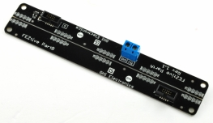

Use the [original Gadgteer driver](https://github.com/ghi-electronics/NETMF-Gadgeteer/tree/master/Modules/GHIElectronics/FEZtive) as a reference.
* [Schematic](http://files.ghielectronics.com/downloads/Schematics/Gadgeteer/FEZtive%20Module%20Schematic.pdf)

# Flash


Use the [original Gadgteer driver](https://github.com/ghi-electronics/NETMF-Gadgeteer/tree/master/Modules/GHIElectronics/FLASH) as a reference.
* [Schematic](http://files.ghielectronics.com/downloads/Schematics/Gadgeteer/FLASH%20Module%20Schematic.pdf)

# GPS
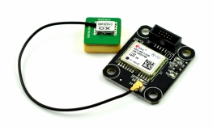

Use the [original Gadgteer driver](https://github.com/ghi-electronics/NETMF-Gadgeteer/tree/master/Modules/GHIElectronics/GPS) as a reference.
* [Schematic](http://files.ghielectronics.com/downloads/Schematics/Gadgeteer/GPS%20Module%20Schematic.pdf)

# GasSense


This module can host several different air sensors, like Alcohol and CO2.

The sensor has an internal heater that needs to be enabled and then it is a simple analog read.

```
using System.Threading;
using System.Diagnostics;
using GHIElectronics.TinyCLR.Devices.Adc;
using GHIElectronics.TinyCLR.Devices.Gpio;
using GHIElectronics.TinyCLR.Pins;

class Program {
    static void Main() {
        var Enable = GpioController.GetDefault().OpenPin(FEZSpider.GpioPin.Socket10.Pin4);
        Enable.SetDriveMode(GpioPinDriveMode.Output);
        Enable.Write(GpioPinValue.High);// Enable the internal heater

        var Ain = AdcController.GetDefault().OpenChannel(FEZSpider.AdcChannel.Socket10.Pin3);
        while (true) {
            Debug.WriteLine("Ain: " + Ain.ReadRatio());
            Thread.Sleep(500);
        }
    }
}
```
* [Schematic](http://files.ghielectronics.com/downloads/Schematics/Gadgeteer/GasSense%20Module%20Schematic.pdf)

# Gyro


Use the [original Gadgteer driver](https://github.com/ghi-electronics/NETMF-Gadgeteer/tree/master/Modules/GHIElectronics/Gyro) as a reference.
* [Schematic](http://files.ghielectronics.com/downloads/Schematics/Gadgeteer/Gyro%20Module%20Schematic.pdf)

# HD44780


See the [Character Display](#character-display) Module
* [Schematic](http://files.ghielectronics.com/downloads/Schematics/Gadgeteer/HD44780%20Module%20Schematic.pdf)

# HubAP5
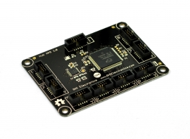

No hub support is currently planned.
* [Schematic](http://files.ghielectronics.com/downloads/Schematics/Gadgeteer/Hub%20AP5%20Module%20Schematic.pdf)

# IO60P16


This module provide 60 IOs and 16 PWM pins.
Use the [original Gadgteer driver](https://github.com/ghi-electronics/NETMF-Gadgeteer/tree/master/Modules/GHIElectronics/IP60P16) as a reference.
* [Schematic](http://files.ghielectronics.com/downloads/Schematics/Gadgeteer/IO60P16%20Module%20Schematic.pdf)

# IR Receiver


Use the [original Gadgteer driver](https://github.com/ghi-electronics/NETMF-Gadgeteer/tree/master/Modules/GHIElectronics/IRReceiver) as a reference.
* [Schematic](http://files.ghielectronics.com/downloads/Schematics/Gadgeteer/IRReceiver%20Module%20Schematic.pdf)

# Joystick
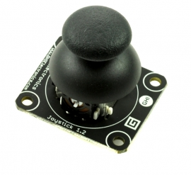

The Joystick module has two analog inputs for X and Y position. Pressing the knob also works like a button.

```
using System.Threading;
using System.Diagnostics;
using GHIElectronics.TinyCLR.Devices.Adc;
using GHIElectronics.TinyCLR.Devices.Gpio;
using GHIElectronics.TinyCLR.Pins;

class Program {
    static void Main() {
        var AinX = AdcController.GetDefault().OpenChannel(FEZSpider.AdcChannel.Socket10.Pin4);
        var AinY = AdcController.GetDefault().OpenChannel(FEZSpider.AdcChannel.Socket10.Pin5);
        var Button = GpioController.GetDefault().OpenPin(FEZSpider.GpioPin.Socket10.Pin3);
        Button.SetDriveMode(GpioPinDriveMode.InputPullUp);

        while (true) {
            Debug.WriteLine("PosX: " + AinX.ReadRatio() + "%"+ "PosY: " + AinY.ReadRatio() + "%");
            if (Button.Read() == GpioPinValue.Low)
                Debug.WriteLine("Pressed!");
            Thread.Sleep(500);
        }
    }
}
```
* [Schematic](http://files.ghielectronics.com/downloads/Schematics/Gadgeteer/Joystick%20Module%20Schematic.pdf)

# Keypad KP16
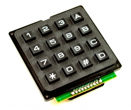

Use the [original Gadgteer driver](https://github.com/ghi-electronics/NETMF-Gadgeteer/tree/master/Modules/GHIElectronics/KeypadKP16) as a reference.
* [Schematic](http://files.ghielectronics.com/downloads/Schematics/Gadgeteer/Keypad%20KP16%20Module%20Schematic.pdf)

# LED 7C
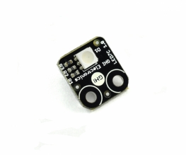

An LED that can be set to one of 7 colors, 8 if you count off!

```
using System.Threading;
using System.Diagnostics;
using GHIElectronics.TinyCLR.Devices.Adc;
using GHIElectronics.TinyCLR.Devices.Gpio;
using GHIElectronics.TinyCLR.Pins;

class Program {
    static void Main() {
        var GPIO = GpioController.GetDefault();
        var Red = GPIO.OpenPin(FEZSpider.GpioPin.Socket8.Pin4);
        Red.SetDriveMode(GpioPinDriveMode.Output);
        var Green = GPIO.OpenPin(FEZSpider.GpioPin.Socket8.Pin5);
        Green.SetDriveMode(GpioPinDriveMode.Output);
        var Blue = GPIO.OpenPin(FEZSpider.GpioPin.Socket8.Pin3);
        Blue.SetDriveMode(GpioPinDriveMode.Output);

        while (true) {
            // Off
            Red.Write(GpioPinValue.Low); Green.Write(GpioPinValue.Low); Blue.Write(GpioPinValue.Low);
            Thread.Sleep(500);
            // Red
            Red.Write(GpioPinValue.High); Green.Write(GpioPinValue.Low); Blue.Write(GpioPinValue.Low);
            Thread.Sleep(500);
            // Green
            Red.Write(GpioPinValue.Low); Green.Write(GpioPinValue.High); Blue.Write(GpioPinValue.Low);
            Thread.Sleep(500);
            // Blue
            Red.Write(GpioPinValue.Low); Green.Write(GpioPinValue.Low); Blue.Write(GpioPinValue.High);
            Thread.Sleep(500);
            // White
            Red.Write(GpioPinValue.High); Green.Write(GpioPinValue.High); Blue.Write(GpioPinValue.High);
            Thread.Sleep(500);
            // Yellow
            Red.Write(GpioPinValue.High); Green.Write(GpioPinValue.High); Blue.Write(GpioPinValue.Low);
            Thread.Sleep(500);
            // Magenta
            Red.Write(GpioPinValue.High); Green.Write(GpioPinValue.Low); Blue.Write(GpioPinValue.High);
            Thread.Sleep(500);
            // Cyan
            Red.Write(GpioPinValue.Low); Green.Write(GpioPinValue.High); Blue.Write(GpioPinValue.High);
            Thread.Sleep(500);
        }
    }
}
```
* [Schematic](http://files.ghielectronics.com/downloads/Schematics/Gadgeteer/LED%207C%20Module%20Schematic.pdf)

# LED 7R


This is a ring of 6 LEDs and a 7th center LED.
Reference the LED 7C module for using pins.

Center LED: pin 9
LEDs going clockwise starting from LEDs D1 to D6 on the board D1, D2, D3, D4, D5, D6 are pins 3 to 8 respectively.
* [Schematic](http://files.ghielectronics.com/downloads/Schematics/Gadgeteer/LED%207R%20Module%20Schematic.pdf)

# LED Strip
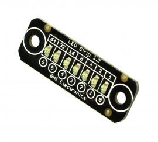

A strip of 7 LEDs, connected to pins 3 through 9. Reference the LED 7C module for using pins.
* [Schematic](http://files.ghielectronics.com/downloads/Schematics/Gadgeteer/LED%20Strip%20Module%20Schematic.pdf)

# Light Sense
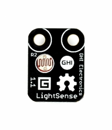

Simply using analog on pin 3. Use the same code as the potentiometer.
* [Schematic](http://files.ghielectronics.com/downloads/Schematics/Gadgeteer/LightSense%20Module%20Schematic.pdf)

# Load


Each one of the 7 GPIO pins are connected to a transistor to handle a load, like a motor.
* [Schematic](http://files.ghielectronics.com/downloads/Schematics/Gadgeteer/Load%20Module%20Schematic.pdf)

# MaxO
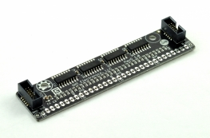

Shift registers used to take serial SPI data and put on parallel pins, perfect for driving tons of LEDs. This video explains how this works

Use the [original Gadgteer driver](https://github.com/ghi-electronics/NETMF-Gadgeteer/tree/master/Modules/GHIElectronics/MaxO) as a reference.

<iframe width="560" height="315" src="https://www.youtube.com/embed/2qYLsM9DoBI" frameborder="0" allowfullscreen></iframe>

* [Schematic](http://files.ghielectronics.com/downloads/Schematics/Gadgeteer/MaxO%20Module%20Schematic.pdf)

# MicroSD Card


No file system support yet.
* [Schematic](http://files.ghielectronics.com/downloads/Schematics/Gadgeteer/MicroSD%20Card%20Module%20Schematic.pdf)

# Moisture


This is a simple analog input measuring the direct resistance (moisture). An enable pin needs to be activated.

```
using System.Threading;
using System.Diagnostics;
using GHIElectronics.TinyCLR.Devices.Adc;
using GHIElectronics.TinyCLR.Devices.Gpio;
using GHIElectronics.TinyCLR.Pins;

class Program {
    static void Main() {
        var Enable = GpioController.GetDefault().OpenPin(FEZSpider.GpioPin.Socket10.Pin6);
        Enable.SetDriveMode(GpioPinDriveMode.Output);
        Enable.Write(GpioPinValue.High);// Enable

        var Ain = AdcController.GetDefault().OpenChannel(FEZSpider.AdcChannel.Socket10.Pin3);
        while (true) {
            Debug.WriteLine("Ain: " + Ain.ReadRatio());
            Thread.Sleep(500);
        }
    }
}
```
* [Schematic](http://files.ghielectronics.com/downloads/Schematics/Gadgeteer/Moisture%20Sensor%20Module%20Schematic.pdf)

# Motor Driver


The Motor Driver Module uses L298 H-bridge that can drive two motors up to 4A.

* Pin 6: Motor A Direction (GPIO)
* Pin 7: Motor A Speed (PWM)
* Pin 8: Motor B Direction (GPIO)
* Pin 9: Motor B Speed (PWM)

> [!Tip]
> NETMF didn't handle PWM correctly. TinyCLR OS breaks PWM pins to individual channels. Read more about [PWM](../../../tinyclr/tutorials/pwm.md).

This example will setup both motors and then will make motor A go very slow forward then very fast backward, in a loop.

```
using System.Threading;
using GHIElectronics.TinyCLR.Devices.Pwm;
using GHIElectronics.TinyCLR.Devices.Gpio;
using GHIElectronics.TinyCLR.Pins;

class Program {
    static void Main() {
        // Determine what PWM controller is used for specific pins, use the power of intellisense!
        // start typing FEZSpider.PwmPin. to navigate the options

        // Motor A
        var MotorDirA = GpioController.GetDefault().OpenPin(FEZSpider.GpioPin.Socket8.Pin6);
        MotorDirA.SetDriveMode(GpioPinDriveMode.Output);
        var ControllerA = PwmController.FromId(FEZSpider.PwmPin.Controller1.Id);
        ControllerA.SetDesiredFrequency(5000);
        var MotorSpeedA = ControllerA.OpenPin(FEZSpider.PwmPin.Controller1.Socket8.Pin7);

        // Motor B
        var MotorDirB = GpioController.GetDefault().OpenPin(FEZSpider.GpioPin.Socket8.Pin8);
        MotorDirB.SetDriveMode(GpioPinDriveMode.Output);
        var ControllerB = PwmController.FromId(FEZSpider.PwmPin.Controller1.Id);
        ControllerB.SetDesiredFrequency(5000);
        var MotorSpeedB = ControllerB.OpenPin(FEZSpider.PwmPin.Controller1.Socket8.Pin9);

        while (true) {
            MotorDirA.Write(GpioPinValue.High);// Forward
            MotorSpeedA.SetActiveDutyCyclePercentage(0.1);// slow 10%
            Thread.Sleep(500);

            MotorDirA.Write(GpioPinValue.Low);// Backwards
            MotorSpeedA.SetActiveDutyCyclePercentage(0.9);// fast 90%
            Thread.Sleep(500);
        }
    }
}
```
* [Schematic](http://files.ghielectronics.com/downloads/Schematics/Gadgeteer/Motor%20Driver%20L298%20Module%20Schematic.pdf)

# Multicolor LED


A DaisyLink module, we will not support.
* [Schematic](http://files.ghielectronics.com/downloads/Schematics/Gadgeteer/Multicolor%20LED%20Module%20Schematic.pdf)

 # Music


The Music Module uses the popular VS1053 decoder chip that decodes MP3, WMA, OGG, MIDI and WAV files.
Use the [original Gadgteer driver](https://github.com/ghi-electronics/NETMF-Gadgeteer/tree/master/Modules/GHIElectronics/Music) as a reference.
* [Schematic](http://files.ghielectronics.com/downloads/Schematics/Gadgeteer/Music%20Module%20Schematic.pdf)

# Null Modem


No driver is needed.

# OBD II


Use the [original Gadgteer driver](https://github.com/ghi-electronics/NETMF-Gadgeteer/tree/master/Modules/GHIElectronics/OBDII) as a reference.

# OneWire X1
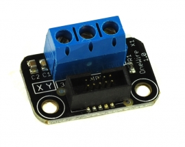

A breakout with a terminal block for easily connecting OneWire devices, specifically the common temperature probes.

OneWire is not supported yet.
* [Schematic](http://files.ghielectronics.com/downloads/Schematics/Gadgeteer/OneWire%20X1%20Module%20Schematic.pdf)

# PIR


Motion detection. Simply pin 3 changes its state when it detects motion.
* [Schematic](http://files.ghielectronics.com/downloads/Schematics/Gadgeteer/PIR%20Module%20Schematic.pdf)

# Parallel CNC


A DaisyLink module, we will not support.
* [Schematic](http://files.ghielectronics.com/downloads/Schematics/Gadgeteer/Parallel%20CNC%20Module%20Schematic.pdf)

# Potentiometer
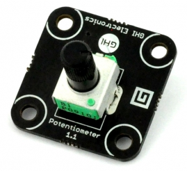

The Potentiometer module is simply a variable resistor connected to pin3. Rotating its knob will result in an analog value changing from min to max.

```
using System.Threading;
using System.Diagnostics;
using GHIElectronics.TinyCLR.Devices.Adc;
using GHIElectronics.TinyCLR.Pins;

class Program {
    static void Main() {
        var Ain = AdcController.GetDefault().OpenChannel(FEZSpider.AdcChannel.Socket10.Pin3);

        while (true) {
            Debug.WriteLine("Pos: " + Ain.ReadRatio() + "%");
            Thread.Sleep(500);
        }
    }
}
```
* [Schematic](http://files.ghielectronics.com/downloads/Schematics/Gadgeteer/Potentiometer%20Module%20Schematic.pdf)

# Pulse Count
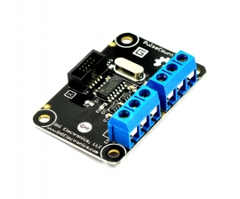

Use the [original Gadgteer driver](https://github.com/ghi-electronics/NETMF-Gadgeteer/tree/master/Modules/GHIElectronics/PulseCount) as a reference.
* [Schematic](http://files.ghielectronics.com/downloads/Schematics/Gadgeteer/Pulse%20Count%20Module%20Schematic.pdf)


# Pulse InOut


A DaisyLink module, we will not support.
* [Schematic](http://files.ghielectronics.com/downloads/Schematics/Gadgeteer/Pulse%20In%20Out%20Module%20Schematic.pdf)

# Pulse Oximeter


Use the [original Gadgteer driver](https://github.com/ghi-electronics/NETMF-Gadgeteer/tree/master/Modules/GHIElectronics/PulseOximeter) as a reference.
* [Schematic](http://files.ghielectronics.com/downloads/Schematics/Gadgeteer/Pulse%20Oximeter%20Module%20Schematic.pdf)

# RFID Reader


Use the [original Gadgteer driver](https://github.com/ghi-electronics/NETMF-Gadgeteer/tree/master/Modules/GHIElectronics/RFIDReader) as a reference.
* [Schematic](http://files.ghielectronics.com/downloads/Schematics/Gadgeteer/RFID%20Module%20Schematic.pdf)

# RS232


Simply a serial port.
* [Schematic](http://files.ghielectronics.com/downloads/Schematics/Gadgeteer/RS232%20Module%20Schematic.pdf)

# RS485 


Simply a serial port.
* [Schematic](http://files.ghielectronics.com/downloads/Schematics/Gadgeteer/RS485%20Module%20Schematic.pdf)

# Radio FM1


Use the [original Gadgteer driver](https://github.com/ghi-electronics/NETMF-Gadgeteer/tree/master/Modules/GHIElectronics/RadioFM1) as a reference.
* [Schematic](http://files.ghielectronics.com/downloads/Schematics/Gadgeteer/Radio%20FM1%20Module%20Schematic.pdf)

# Reflector R3


Use the [original Gadgteer driver](https://github.com/ghi-electronics/NETMF-Gadgeteer/tree/master/Modules/GHIElectronics/ReflectorR3) as a reference.
* [Schematic](http://files.ghielectronics.com/downloads/Schematics/Gadgeteer/Reflector%20R3%20Module%20Schematic.pdf)

# Relay ISOx16


An array of 16 relays. Operate similar to the MaxO module.

Use the [original Gadgteer driver](https://github.com/ghi-electronics/NETMF-Gadgeteer/tree/master/Modules/GHIElectronics/RelayISOx16) as a reference.
* [Schematic](http://files.ghielectronics.com/downloads/Schematics/Gadgeteer/Relay%20ISOx16%20Module%20Schematic.pdf)

# Relay X1
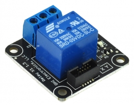

Simply set pin 3 high to activate the relay.
* [Schematic](http://files.ghielectronics.com/downloads/Schematics/Gadgeteer/Relay%20X1%20Module%20Schematic.pdf)

# Rotary H1


Use the [original Gadgteer driver](https://github.com/ghi-electronics/NETMF-Gadgeteer/tree/master/Modules/GHIElectronics/RotaryH1) as a reference.
* [Schematic](http://files.ghielectronics.com/downloads/Schematics/Gadgeteer/Rotary%20H1%20Module%20Schematic.pdf)

# SD Card


File system is not supported yet.
* [Schematic](http://files.ghielectronics.com/downloads/Schematics/Gadgeteer/SDCard%20Module%20Schematic.pdf)

# S-Plus


We will not support hubs.
* [Schematic](http://files.ghielectronics.com/downloads/Schematics/Gadgeteer/SPlus%20Module%20Schematic.pdf)

# Serial Camera


Use the [original Gadgteer driver](https://github.com/ghi-electronics/NETMF-Gadgeteer/tree/master/Modules/GHIElectronics/SerialCameraL1) as a reference.

# Stepper L6470


Use the [original Gadgteer driver](https://github.com/ghi-electronics/NETMF-Gadgeteer/tree/master/Modules/GHIElectronics/StepperL6470) as a reference.
* [Schematic](http://files.ghielectronics.com/downloads/Schematics/Gadgeteer/Stepper%20L647x%20Module%20Schematic.pdf)

# TempHumidity


Use the [original Gadgteer driver](https://github.com/ghi-electronics/NETMF-Gadgeteer/tree/master/Modules/GHIElectronics/TempHumidity) as a reference.
* [Schematic](http://files.ghielectronics.com/downloads/Schematics/Gadgeteer/Temp%20Humid%20SI70%20Module%20Schematic.pdf)

# Thermocouple


Use the [original Gadgteer driver](https://github.com/ghi-electronics/NETMF-Gadgeteer/tree/master/Modules/GHIElectronics/Thermocouple) as a reference.
* [Schematic](http://files.ghielectronics.com/downloads/Schematics/Gadgeteer/Thermocouple%20Module%20Schematic.pdf)

# Touch C8
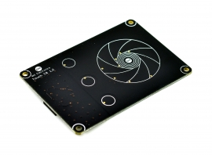

Use the [original Gadgteer driver](https://github.com/ghi-electronics/NETMF-Gadgeteer/tree/master/Modules/GHIElectronics/TouchC8) as a reference.
* [Schematic](http://files.ghielectronics.com/downloads/Schematics/Gadgeteer/Touch%20C8%20Module%20Schematic.pdf)

# Touch L12
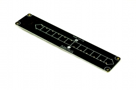

Use the [original Gadgteer driver](https://github.com/ghi-electronics/NETMF-Gadgeteer/tree/master/Modules/GHIElectronics/TouchL12) as a reference.
* [Schematic](http://files.ghielectronics.com/downloads/Schematics/Gadgeteer/Touch%20L12%20Module%20Schematic.pdf)

# Tunes
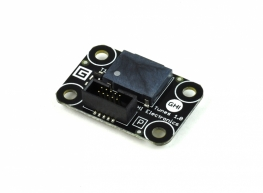

The Tunes Module is a tiny speaker that is connected to pin 9. Use PWM to generate sounds

This example will keep changing the frequency.

```
using System.Threading;
using GHIElectronics.TinyCLR.Devices.Pwm;
using GHIElectronics.TinyCLR.Pins;

class Program {
    static void Main() {
        var controller = PwmController.FromId(FEZSpider.PwmPin.Controller0.Id);
        var buzz = controller.OpenPin(FEZSpider.PwmPin.Controller0.Socket11.Pin9);

        controller.SetDesiredFrequency(500);// change the frequency for sounds
        buzz.SetActiveDutyCyclePercentage(0.5);// always use this for sounds
        buzz.Start();

        while (true) {
            controller.SetDesiredFrequency(500);
            Thread.Sleep(500);
            controller.SetDesiredFrequency(200);
            Thread.Sleep(500);
        }
    }
}
```
* [Schematic](http://files.ghielectronics.com/downloads/Schematics/Gadgeteer/Tunes%20Module%20Schematic.pdf)

# UC Battery 4xAA


No driver is needed.
* [Schematic](http://files.ghielectronics.com/downloads/Schematics/Gadgeteer/UC%20Battery%204xAA%20Module%20Schematic.pdf)

# USB Client DP


No driver is needed.
* [Schematic](http://files.ghielectronics.com/downloads/Schematics/Gadgeteer/USB%20Client%20DP%20Module%20Schematic.pdf)

# USB Client SP


No driver is needed.
* [Schematic](http://files.ghielectronics.com/downloads/Schematics/Gadgeteer/USB%20Client%20SP%20Module%20Schematic.pdf)

# USB Host
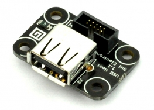

USB Host is not currently supported.
* [Schematic](http://files.ghielectronics.com/downloads/Schematics/Gadgeteer/USB%20Host%20Module%20Schematic.pdf)

# USB Serial


Simply, a serial port.
* [Schematic](http://files.ghielectronics.com/downloads/Schematics/Gadgeteer/Serial%20USB%20Module%20Schematic.pdf)

# USB Serial SP


Simply, a serial port.
* [Schematic](http://files.ghielectronics.com/downloads/Schematics/Gadgeteer/USB%20Serial%20SP%20Module%20Schematic.pdf)

# VideoOut


Use the [original Gadgteer driver](https://github.com/ghi-electronics/NETMF-Gadgeteer/tree/master/Modules/GHIElectronics/VideoOut) as a reference.
* [Schematic](http://files.ghielectronics.com/downloads/Schematics/Gadgeteer/VideoOut%20Module%20Schematic.pdf)

# WiFi RN171


Use the [original Gadgteer driver](https://github.com/ghi-electronics/NETMF-Gadgeteer/tree/master/Modules/GHIElectronics/WiFiRN171) as a reference.
* [Schematic](http://files.ghielectronics.com/downloads/Schematics/Gadgeteer/WiFi%20RN171%20Module%20Schematic.pdf)

# WiFi RS21
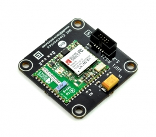

Will not be supported, NDA issues.
* [Schematic](http://files.ghielectronics.com/downloads/Schematics/Gadgeteer/WiFi%20RS21%20Module%20Schematic.pdf)

# XBee Adapter


Simply, a serial port. From there a driver like https://xbee.codeplex.com/ will help.
* [Schematic](http://files.ghielectronics.com/downloads/Schematics/Gadgeteer/XBee%20Module%20Schematic.pdf)
