# .NET Gadgeteer Modules
This page lists all .NET Gadgeteer modules and how can they be used with [TinyCLR OS](../../../tinyclr/intro.md). If you are planning on using the old NETMF/Gadgeteer software then read the [.NET Gadgeteer Intro](intro.md) page.

> [!Tip]
> We discourage writing specific drivers that can't be used outside gadgeteer. It should be easy to transition from a gadgeteer to a non-gadgeteer design.
> If a module is simple, then no driver at all is provided!

> [!Tip]
> You can use Intellisense with the pin definition class to quickly determine where things go.
> For example: Typing `FezSpider.GpioPin.Socket3.` lists the available GPIO pins on scoekt3
> Another example: Typing `FezSpider.UartPort.` lists all available UART sockets (that is U in the old Gadgeteer standard)

> [!Tip]
> We will be using the original, and most popular, FEZ Spider as a base for this page but any other mainboard will work very similarly.


# Accel G248


The Accel G248 measures acceleration though I2C bus.

Coming Soon! https://github.com/ghi-electronics/NETMF-Gadgeteer/blob/master/Modules/GHIElectronics/AccelG248/AccelG248_43/AccelG248_43.cs

# Barometer


https://github.com/ghi-electronics/NETMF-Gadgeteer/tree/master/Modules/GHIElectronics/Barometer

# Bluetooth


https://github.com/ghi-electronics/NETMF-Gadgeteer/tree/master/Modules/GHIElectronics/Bluetooth
# Breadboard X1


An easy breadboard option. Simply access the socket directly to wire whatver your heart desires!

# Breakout

Simply a breakout of all signals.

# Breakout TB10
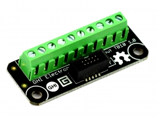

Simply a breakout of all signals, on a terminal block.

# Button


The Button module is very simple, with a button connected to pin 3 and an LED connected to pin4.

This example will blink the LED a different rate, depending on the button press.
```
using System.Threading;
using GHIElectronics.TinyCLR.Devices.Gpio;
using GHIElectronics.TinyCLR.Pins;

class Program {
    static void Main() { 
        var LED = GpioController.GetDefault().OpenPin(FEZSpiderII.GpioPin.Socket1.Pin3);
        LED.SetDriveMode(GpioPinDriveMode.Output);

        var Button = GpioController.GetDefault().OpenPin(FEZSpiderII.GpioPin.Socket4.Pin4);
        Button.SetDriveMode(GpioPinDriveMode.InputPullUp);
        var speed = 200;
        while (true) {
            if (Button.Read() == GpioPinValue.High)
                speed = 200;// high = button is not pressed
            else
                speed = 500;// low = button is pressed

            // blink the LED
            LED.Write(GpioPinValue.High);
            Thread.Sleep(speed);
            LED.Write(GpioPinValue.Low);
            Thread.Sleep(speed);
        }
    }
}
```
# Button S7
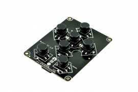

7 buttons on a single module, with LEDs that light up with button presses! 

Use the same code example provided for the Button Module.

Buttons map:
* Left: Pin  
* Right: Pin 8
* Up: Pin 6
* Down: Pin 7
* Enter: Pin 3
* Back: Pin 4
* Forward: Pin 9

# CAN DW
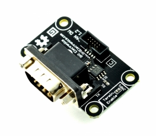

CAN is not yet supported in TinyCLR OS, you can add it if you are up for a challenge!

# Camera


USB Host is not supported in TinyCLR OS

# Cellular Radio


Coming soon!
https://github.com/ghi-electronics/NETMF-Gadgeteer/tree/master/Modules/GHIElectronics/CellularRadio

# Character Display
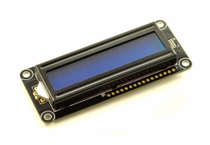

This is a standard and very common HD44780 display.

Coming soon! https://github.com/ghi-electronics/NETMF-Gadgeteer/blob/master/Modules/GHIElectronics/CharacterDisplay/CharacterDisplay_43/CharacterDisplay_43.cs

# ColorSense


A color sensor that uses software I2C, not yet supported in TinyCLR OS.

Coming soon!
https://github.com/ghi-electronics/NETMF-Gadgeteer/blob/master/Modules/GHIElectronics/ColorSense/ColorSense_43/ColorSense_43.cs

# Compass
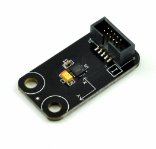

Coming soon!
https://github.com/ghi-electronics/NETMF-Gadgeteer/tree/master/Modules/GHIElectronics/Compass

# Current ACS712


This is a current sensor that uses ACS712, which simply outputs an analog voltage.
add example that shows the conversion math https://github.com/ghi-electronics/NETMF-Gadgeteer/blob/master/Modules/GHIElectronics/CurrentACS712/CurrentACS712_43/CurrentACS712_43.cs

# Display CP7
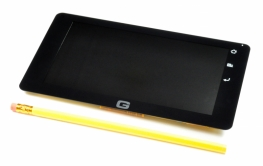

Read more about the [display support](../../../tinyclr/tutorials/display.md) on TinyCLR OS.
The configurations for the display:
```
// these are the wrong values!
Width = 480,
Height = 272,
PixelClockRate = 20000000,
PixelPolarity = false,
OutputEnablePolarity = true,
OutputEnableIsFixed = false,
HorizontalFrontPorch = 2,
HorizontalBackPorch = 2,
HorizontalSyncPulseWidth = 41,
HorizontalSyncPolarity = false,
VerticalFrontPorch = 2,
VerticalBackPorch = 2,
VerticalSyncPulseWidth = 10,
VerticalSyncPolarity = false,
```

# Display N18


This is an SPI display that can work on any system, even small ones without TFT display support.
Coming soon! Use the old BrainPad driver.


# Display N7


Read more about the [display support](../../../tinyclr/tutorials/display.md) on TinyCLR OS.
The configurations for the display:
```
// these are the wrong values!
Width = 480,
Height = 272,
PixelClockRate = 20000000,
PixelPolarity = false,
OutputEnablePolarity = true,
OutputEnableIsFixed = false,
HorizontalFrontPorch = 2,
HorizontalBackPorch = 2,
HorizontalSyncPulseWidth = 41,
HorizontalSyncPolarity = false,
VerticalFrontPorch = 2,
VerticalBackPorch = 2,
VerticalSyncPulseWidth = 10,
VerticalSyncPolarity = false,
```


# Display NHVN
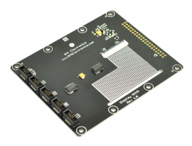

This allows the use of several displays offered by http://newhavendisplay.com/

Supported displays:
* 1
* 2
* 3


# Display T35


Read more about the [display support](../../../tinyclr/tutorials/display.md) on TinyCLR OS.
The configurations for the display:
```
// these are the wrong values!
Width = 480,
Height = 272,
PixelClockRate = 20000000,
PixelPolarity = false,
OutputEnablePolarity = true,
OutputEnableIsFixed = false,
HorizontalFrontPorch = 2,
HorizontalBackPorch = 2,
HorizontalSyncPulseWidth = 41,
HorizontalSyncPolarity = false,
VerticalFrontPorch = 2,
VerticalBackPorch = 2,
VerticalSyncPulseWidth = 10,
VerticalSyncPolarity = false,
```

# Display T43


Read more about the [display support](../../../tinyclr/tutorials/display.md) on TinyCLR OS.
The configurations for the display:
```
// these are the wrong values!
Width = 480,
Height = 272,
PixelClockRate = 20000000,
PixelPolarity = false,
OutputEnablePolarity = true,
OutputEnableIsFixed = false,
HorizontalFrontPorch = 2,
HorizontalBackPorch = 2,
HorizontalSyncPulseWidth = 41,
HorizontalSyncPolarity = false,
VerticalFrontPorch = 2,
VerticalBackPorch = 2,
VerticalSyncPulseWidth = 10,
VerticalSyncPolarity = false,
```

# Display TE35


Read more about the [display support](../../../tinyclr/tutorials/display.md) on TinyCLR OS.
The configurations for the display:
```
// these are the wrong values!
Width = 480,
Height = 272,
PixelClockRate = 20000000,
PixelPolarity = false,
OutputEnablePolarity = true,
OutputEnableIsFixed = false,
HorizontalFrontPorch = 2,
HorizontalBackPorch = 2,
HorizontalSyncPulseWidth = 41,
HorizontalSyncPolarity = false,
VerticalFrontPorch = 2,
VerticalBackPorch = 2,
VerticalSyncPulseWidth = 10,
VerticalSyncPolarity = false,
```

# Distance US3
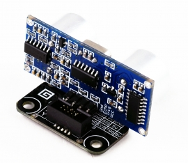

A very common ultrasonic sensor that works by sending a pulse on the trig and measuring the response time on echo pin.

```
I have the code in the robot example
```


# Ethernet ENC28


Requires an internal support in the TinyCLR OS port.

# Ethernet J11D


Requires an internal support in the TinyCLR OS port.

# Extender
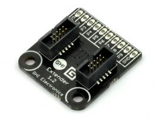

No drivers are needed.

# FEZtive


https://github.com/ghi-electronics/NETMF-Gadgeteer/tree/master/Modules/GHIElectronics/FEZtive

# Flash
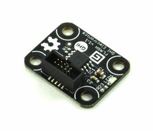

Coming soon!
https://github.com/ghi-electronics/NETMF-Gadgeteer/tree/master/Modules/GHIElectronics/FLASH

# GPS


Coming soon!
https://github.com/ghi-electronics/NETMF-Gadgeteer/tree/master/Modules/GHIElectronics/GPS

# GasSense


This module can host several different air sensors, like Alcohol and CO2.

The sensor has an internal heater that needs to be enabled and then it is a simple analog read.

```
using System.Threading;
using System.Diagnostics;
using GHIElectronics.TinyCLR.Devices.Adc;
using GHIElectronics.TinyCLR.Devices.Gpio;
using GHIElectronics.TinyCLR.Pins;

class Program {
    static void Main() {
        var Enable = GpioController.GetDefault().OpenPin(FEZSpiderII.GpioPin.Socket10.Pin4);
        Enable.SetDriveMode(GpioPinDriveMode.Output);
        Enable.Write(GpioPinValue.High);// Enable the internal heater

        var Ain = AdcController.GetDefault().OpenChannel(FEZSpiderII.AdcChannel.Socket10.Pin3);
        while (true) {
            Debug.WriteLine("Ain: " + Ain.ReadRatio());
            Thread.Sleep(500);
        }
    }
}
```

# Gyro


Coming soon! 
https://github.com/ghi-electronics/NETMF-Gadgeteer/tree/master/Modules/GHIElectronics/Gyro

# HD44780
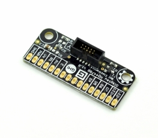

See the Character Display Module

# HubAP5


No hub support is currently planned.

# IO60P16


This module provide 60 IOs and 16 PWM pins.
Will not be ported but you can port the [original driver](https://github.com/ghi-electronics/NETMF-Gadgeteer/tree/master/Modules/GHIElectronics/IO60P16).

# IR Receiver


Coming soon!
https://github.com/ghi-electronics/NETMF-Gadgeteer/tree/master/Modules/GHIElectronics/IRReceiver


# Joystick


The Joystick module has two analog inputs for X and Y position. Pressing the knob also works like a button.

```
using System.Threading;
using System.Diagnostics;
using GHIElectronics.TinyCLR.Devices.Adc;
using GHIElectronics.TinyCLR.Devices.Gpio;
using GHIElectronics.TinyCLR.Pins;

class Program {
    static void Main() {
        var AinX = AdcController.GetDefault().OpenChannel(FEZSpiderII.AdcChannel.Socket10.Pin4);
        var AinY = AdcController.GetDefault().OpenChannel(FEZSpiderII.AdcChannel.Socket10.Pin5);
        var Button = GpioController.GetDefault().OpenPin(FEZSpiderII.GpioPin.Socket10.Pin3);
        Button.SetDriveMode(GpioPinDriveMode.InputPullUp);

        while (true) {
            Debug.WriteLine("PosX: " + AinX.ReadRatio() + "%"+ "PosY: " + AinY.ReadRatio() + "%");
            if (Button.Read() == GpioPinValue.Low)
                Debug.WriteLine("Pressed!");
            Thread.Sleep(500);
        }
    }
}
```

# Keypad KP16


A numerical Keypad
https://github.com/ghi-electronics/NETMF-Gadgeteer/tree/master/Modules/GHIElectronics/KeypadKP16

# LED 7C


An LED that can be set to one of 7 colors, 8 if you count off!

```
using System.Threading;
using System.Diagnostics;
using GHIElectronics.TinyCLR.Devices.Adc;
using GHIElectronics.TinyCLR.Devices.Gpio;
using GHIElectronics.TinyCLR.Pins;

class Program {
    static void Main() {
        var GPIO = GpioController.GetDefault();
        var Red = GPIO.OpenPin(FEZSpiderII.GpioPin.Socket8.Pin4);
        Red.SetDriveMode(GpioPinDriveMode.Output);
        var Green = GPIO.OpenPin(FEZSpiderII.GpioPin.Socket8.Pin4);
        Green.SetDriveMode(GpioPinDriveMode.Output);
        var Blue = GPIO.OpenPin(FEZSpiderII.GpioPin.Socket8.Pin4);
        Blue.SetDriveMode(GpioPinDriveMode.Output);

        while (true) {
            // Off
            Red.Write(GpioPinValue.Low); Green.Write(GpioPinValue.Low); Blue.Write(GpioPinValue.Low);
            Thread.Sleep(500);
            // Red
            Red.Write(GpioPinValue.High); Green.Write(GpioPinValue.Low); Blue.Write(GpioPinValue.Low);
            Thread.Sleep(500);
            // Green
            Red.Write(GpioPinValue.Low); Green.Write(GpioPinValue.High); Blue.Write(GpioPinValue.Low);
            Thread.Sleep(500);
            // Blue
            Red.Write(GpioPinValue.Low); Green.Write(GpioPinValue.Low); Blue.Write(GpioPinValue.High);
            Thread.Sleep(500);
            // White
            Red.Write(GpioPinValue.High); Green.Write(GpioPinValue.High); Blue.Write(GpioPinValue.High);
            Thread.Sleep(500);
            // Yellow
            Red.Write(GpioPinValue.High); Green.Write(GpioPinValue.High); Blue.Write(GpioPinValue.Low);
            Thread.Sleep(500);
            // Magenta
            Red.Write(GpioPinValue.High); Green.Write(GpioPinValue.Low); Blue.Write(GpioPinValue.High);
            Thread.Sleep(500);
            // Cyan
            Red.Write(GpioPinValue.Low); Green.Write(GpioPinValue.High); Blue.Write(GpioPinValue.High);
            Thread.Sleep(500);
        }
    }
}
```
# LED 7R
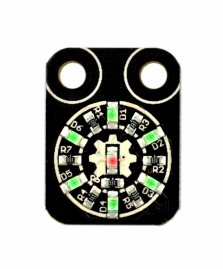

This is a ring of 6 LEDs and a 7th center LED.
Reference the LED 7C module for using pins.

Center LED: pin ??
LEDs in CW starting from the top: 1,2,3,4???

# LED Strip


A strip of 7 LEDs, connected to pins 3 through 9.

# Light Sense


Simply using analog on pin 3. Use the same code as the potentiometer.

# Load
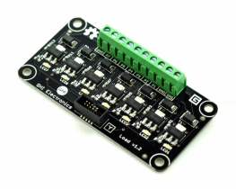

Each one of the 7 GPIO pins are connected to a transistor to handle a load, like a motor.

# MaxO


Shift registers used to take serial SPI data and put on parallel pins, perfect for driving tons of LEDs.

Coming soon!
https://github.com/ghi-electronics/NETMF-Gadgeteer/tree/master/Modules/GHIElectronics/MaxO

# MicroSD Card


No file system support yet.

# Moisture


This is a simple analog input measuring the direct resistance (moisture). An enable pin needs to be activated.

```
using System.Threading;
using System.Diagnostics;
using GHIElectronics.TinyCLR.Devices.Adc;
using GHIElectronics.TinyCLR.Devices.Gpio;
using GHIElectronics.TinyCLR.Pins;

class Program {
    static void Main() {
        var Enable = GpioController.GetDefault().OpenPin(FEZSpiderII.GpioPin.Socket10.Pin6);
        Enable.SetDriveMode(GpioPinDriveMode.Output);
        Enable.Write(GpioPinValue.High);// Enable

        var Ain = AdcController.GetDefault().OpenChannel(FEZSpiderII.AdcChannel.Socket10.Pin3);
        while (true) {
            Debug.WriteLine("Ain: " + Ain.ReadRatio());
            Thread.Sleep(500);
        }
    }
}
```

# Motor Driver


The Motor Driver Module uses L298 H-bridge that can drive two motors up to 4A.

* Pin 6: Motor A Direction (GPIO)
* Pin 7: Motor A Speed (PWM)
* Pin 8: Motor B Direction (GPIO)
* Pin 9: Motor B Speed (PWM)

> [!Tip]
> NETMF didn't handle PWM correctly. TinyCLR OS breaks PWM pins to individual channels. Read more about [PWM](../../../tinyclr/tutorials/pwm.md).

This example will setup both motors and then will make motor A go very slow forward then very fast backward, in a loop.

```
using System.Threading;
using GHIElectronics.TinyCLR.Devices.Pwm;
using GHIElectronics.TinyCLR.Devices.Gpio;
using GHIElectronics.TinyCLR.Pins;

class Program {
    static void Main() {
        // Determine what PWM controller is used for specific pins, use the power of intellisense!
        // start typing FEZSpider.PwmPin. to navigate the options
        // >>>>>>>>>>>> Will this work if we have different controller?

        // Motor A
        var MotorDirA = GpioController.GetDefault().OpenPin(FEZSpiderII.GpioPin.Socket8.Pin6);
        MotorDirA.SetDriveMode(GpioPinDriveMode.Output);
        var ControllerA = PwmController.FromId(FEZSpiderII.PwmPin.Controller1.Id);
        ControllerA.SetDesiredFrequency(5000);
        var MotorSpeedA = ControllerA.OpenPin(FEZSpiderII.PwmPin.Controller1.Socket8.Pin7);

        // Motor B
        var MotorDirB = GpioController.GetDefault().OpenPin(FEZSpiderII.GpioPin.Socket8.Pin8);
        MotorDirB.SetDriveMode(GpioPinDriveMode.Output);
        var ControllerB = PwmController.FromId(FEZSpiderII.PwmPin.Controller1.Id);
        ControllerB.SetDesiredFrequency(5000);
        var MotorSpeedB = ControllerB.OpenPin(FEZSpiderII.PwmPin.Controller1.Socket8.Pin9);

        while (true) {
            MotorDirA.Write(GpioPinValue.High);// Forward
            MotorSpeedA.SetActiveDutyCyclePercentage(0.1);// slow 10%
            Thread.Sleep(500);

            MotorDirA.Write(GpioPinValue.Low);// Backwards
            MotorSpeedA.SetActiveDutyCyclePercentage(0.9);// fast 90%
            Thread.Sleep(500);
        }
    }
}
```
# Multicolor LED


This used daisylink but to chain some super expensive LED!
We will not support this, use some of the many addressable LED options.

# Music


The Music Module uses the popular VS1053 decoder chip that decodes MP3, WMA, OGG, MIDI and WAV files.
Original code is found at [here](https://github.com/ghi-electronics/NETMF-Gadgeteer/tree/master/Modules/GHIElectronics/Music) and needs a volunteer to update.

# Null Modem


No driver is needed.

# OBD II
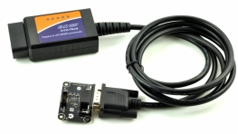

https://github.com/ghi-electronics/NETMF-Gadgeteer/tree/master/Modules/GHIElectronics/OBDII

# OneWire X1


A breakout with a terminal block for easily connecting one wire devices, specifically the common temperature probes.
one wire is not supported yet.
https://github.com/ghi-electronics/NETMF-Gadgeteer/tree/master/Modules/GHIElectronics/OneWireX1

# PIR


Motion detection. Simply pin 3 changes irs state when it detects motion.

# Parallel CNC


Will not be supported.

# Potentiometer


The Potentiometer module is simply a variable resistor connected to pin3. Rotating its knob will result in an analog value changing from min to max.

```
using System.Threading;
using System.Diagnostics;
using GHIElectronics.TinyCLR.Devices.Adc;
using GHIElectronics.TinyCLR.Pins;

class Program {
    static void Main() {
        var Ain = AdcController.GetDefault().OpenChannel(FEZSpiderII.AdcChannel.Socket10.Pin3);

        while (true) {
            Debug.WriteLine("Pos: " + Ain.ReadRatio() + "%");
            Thread.Sleep(500);
        }
    }
}
```
# Pulse Count


https://github.com/ghi-electronics/NETMF-Gadgeteer/tree/master/Modules/GHIElectronics/PulseCount

# Pulse InOut


https://github.com/ghi-electronics/NETMF-Gadgeteer/tree/master/Modules/GHIElectronics/PulseInOut

# Pulse Oximeter


https://github.com/ghi-electronics/NETMF-Gadgeteer/tree/master/Modules/GHIElectronics/PulseOximeter

# RFID Reader
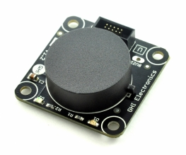

https://github.com/ghi-electronics/NETMF-Gadgeteer/tree/master/Modules/GHIElectronics/RFIDReader

# RS232


Simply a serial port.

# RS485 


Simply a serial port.

# Radio FM1


I have the code on click

# Reflector R3


https://github.com/ghi-electronics/NETMF-Gadgeteer/tree/master/Modules/GHIElectronics/ReflectorR3

# Relay ISOx16
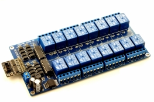

An array of 16 relays.
https://github.com/ghi-electronics/NETMF-Gadgeteer/tree/master/Modules/GHIElectronics/RelayISOx16

# Relay X1


Simply use set pin 3 high to activate the relay.

# Rotary H1


https://github.com/ghi-electronics/NETMF-Gadgeteer/tree/master/Modules/GHIElectronics/RotaryH1

# SD Card
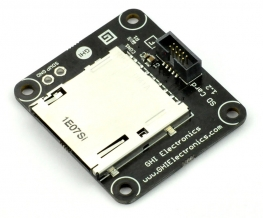

File system is not supported yet.

# S-Plus
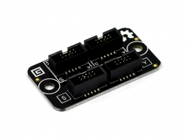

We will not support hubs and inderrections.

# Serial Camera
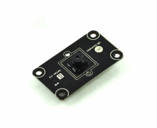

Aren't they both the same?
https://github.com/ghi-electronics/NETMF-Gadgeteer/tree/master/Modules/GHIElectronics/SerialCameraL1
https://github.com/ghi-electronics/NETMF-Gadgeteer/tree/master/Modules/GHIElectronics/SerialCameraL2

# Stepper L6470


https://github.com/ghi-electronics/NETMF-Gadgeteer/tree/master/Modules/GHIElectronics/StepperL6470

# TempHumidity


https://github.com/ghi-electronics/NETMF-Gadgeteer/tree/master/Modules/GHIElectronics/TempHumidity

# Thermocouple
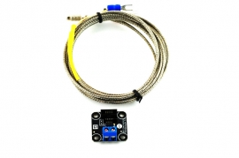

https://github.com/ghi-electronics/NETMF-Gadgeteer/tree/master/Modules/GHIElectronics/Thermocouple

# Touch C8


https://github.com/ghi-electronics/NETMF-Gadgeteer/tree/master/Modules/GHIElectronics/TouchC8

# Touch L12


https://github.com/ghi-electronics/NETMF-Gadgeteer/tree/master/Modules/GHIElectronics/TouchL12

# Tunes


The Tunes Module is a tiny speaker that is connected to pin 9. Use PWM to generate sounds

This example will keep changing the frequency.

```
using System.Threading;
using GHIElectronics.TinyCLR.Devices.Pwm;
using GHIElectronics.TinyCLR.Pins;

class Program {
    static void Main() {
        var controller = PwmController.FromId(FEZSpiderII.PwmPin.Controller0.Id);
        var buzz = controller.OpenPin(FEZSpiderII.PwmPin.Controller0.Socket11.Pin9);

        controller.SetDesiredFrequency(500);// change teh freequency for sounds
        buzz.SetActiveDutyCyclePercentage(0.5);// always use this for sounds
        buzz.Start();

        while (true) {
            controller.SetDesiredFrequency(500);
            Thread.Sleep(500);
            controller.SetDesiredFrequency(200);
            Thread.Sleep(500);
        }
    }
}
```
# UC Battery 4xAA
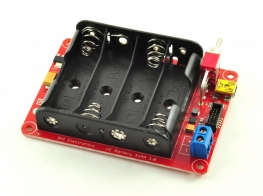

No driver is needed.

# USB Client DP


No driver is needed.

# USB Client SP


No driver is needed.

# USB Host


USB Host is not currently supported.

# USB Serial
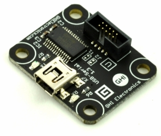

Simply, a serial port.

# USB Serial SP


Simply, a serial port.

# VideoOut
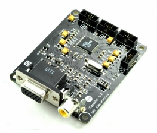

https://github.com/ghi-electronics/NETMF-Gadgeteer/tree/master/Modules/GHIElectronics/VideoOut

# WiFi RN171
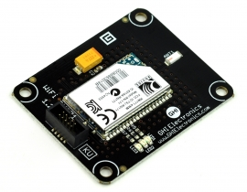

https://github.com/ghi-electronics/NETMF-Gadgeteer/tree/master/Modules/GHIElectronics/WiFiRN171

# WiFi RS21


Will not be supported, NDA issues.

# XBee Adapter
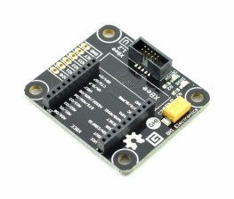

Simply, a serial port. From there a driver like https://xbee.codeplex.com/

