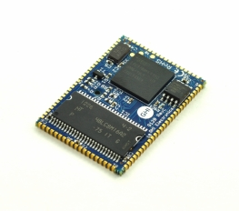

# G120

G120 and G120E are .NET Micro Framework (NETMF) System on Modules.

# Resources
* [Datasheet]()
* [Dev Board Schematics]()

# Using the NETMF software
We discourage the use of NETMF software on our products in favor for TinyCLR OS. [Read more](../legacy_products/netmf/intro.md) about the use of NETMF and TinyCLR OS.

# Using TinyCLR OS
If haven't yet, read about using .NET Gadgeteer devices [with TinyCLR OS](../legacy_products/netmf/intro.md#with-tinyclr-os)

## Loading Bootloader Version 2
1. Download the [bootloader file](http://files.ghielectronics.com/downloads/Bootloaders/G120%20Bootloader.2.0.3.ghi)
2. Set theLDR0 and LDR1 signals low while reseting the board.
4. The PC will now detect a virtual serial (COM) device. If you need drivers, they are in the [NETMF](../legacy_products/netmf/intro.md) SDK.
5. Open any terminal software, we recommend [Tera Term](http://ttssh2.osdn.jp/).
6. Select serial and pick the COM port associated with your board.
7. Enter `E` and you will see back "Erase all memory! Are you sure?" now enter `Y`. (The bootloader is case sensitive)
8. Enter `X` and you will see `CCCC`... showing on the terminal.
9. Now go to `File` -> `Transfer` -> `XMODEM` -> `Send` and then check the `1K` option.
10. Select the bootloader file you have downloaded above.
11. You will see `File Transfer Finished Successfully`.
13. Reset your board, you are now running GHI Electronics bootloader version 2!

## Loading the Firmware

> [!Tip]
> First make sure you have bootloader Version 2 loaded. This needs to be done only once.

To activate bootloader version 2, hold the LDR0 signal low while resetting the board.

Download the [firmware](http://files.ghielectronics.com/downloads/TinyCLR/Firmware/G120/G120%20Firmware.0.6.0.glb) and folow [Loading the Firmware](../legacy_products/netmf/intro.md#loading-the-firmware) steps.

