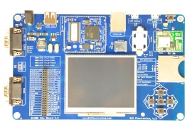

# G120
---

G120 and G120E are .NET Micro Framework (NETMF) System on Modules.

* [Datasheet](http://files.ghielectronics.com/downloads/Documents/Datasheets/G120%20and%20G120E%20Datasheet.pdf)

## Getting Started

Options for programming the G120 include the following:

### Microsoft's .NET Micro Framework (NETMF)
We discourage the use of NETMF software on our products in favor of TinyCLR OS. For more information on NETMF you can go to the [NETMF Introduction](../../software/netmf/intro.md) page.  The [NETMF Getting Started](../../software/netmf/getting-started.md) page covers NETMF from setup of the host computer to program deployment on both an emulator and target device.

### TinyCLR OS
TinyCLR provides a way to program the G120 in C# or Visual Basic using Microsoft Visual Studio.  To get started you must first install the bootloader and firmware on the G120 (instructions below) and then go to the TinyCLR [Getting Started](../../software/tinyclr/getting-started.md) page for instructions on setting up the host computer and writing and deploying programs.

#### Loading Bootloader v2
1. Download the [bootloader file](../../software/tinyclr/loaders/ghi-bootloader.md#g120)
2. Set the LDR0 and LDR1 signals low while resetting the board.
4. The PC will now detect a virtual serial (COM) device. If you need drivers, they are in the [NETMF](../../software/netmf/intro.md) SDK.
5. Open any terminal software, we recommend [Tera Term](http://ttssh2.osdn.jp/).
6. Select serial and pick the COM port associated with your board.
7. Enter `E` and you will see "Erase all memory! Are you sure?" now enter `Y`. (The bootloader is case sensitive)
8. Enter `X` and you will see `CCCC`... showing on the terminal.
9. Now go to `File` -> `Transfer` -> `XMODEM` -> `Send` and then check the `1K` option.
10. Select the bootloader file you have downloaded above.
11. You will see `File Transfer Finished Successfully`.
13. Reset your board, you are now running GHI Electronics bootloader version 2!

#### Loading the Firmware

> [!Tip]
> First make sure you have bootloader v2 loaded. This needs to be done only once.

To activate bootloader v2, hold the LDR0 signal low while resetting the board.

Download the [G120 firmware](../../software/tinyclr/downloads.md#g120) and follow [Loading the Firmware](../../software/tinyclr/loaders/ghi-bootloader.md#loading-the-firmware) steps.

## G120 Development Board
 

The development system used for evaluating the G120 SoM.

* [Schematic](http://files.ghielectronics.com/downloads/Schematics/Systems/G120E%20Dev%20Board%20Schematic.pdf)

***

TinyCLR lets you program our devices (and others) in C# or Visual Basic using Microsoft's Visual Studio -- and it's all free!  [**Learn more...**](../../software/tinyclr/intro.md).

You can also visit our main website at [**www.ghielectronics.com**](http://www.ghielectronics.com) and our community forums at [**forums.ghielectronics.com**](https://forums.ghielectronics.com/).
