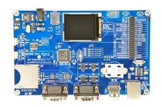

# G80
---

## Overview

The G80 SoC is a low-cost System on Chip part of the GHI Electronics SurfaceMount Compute Modules (SCM) line. This modules can be programmed in .NET C# and Visual Basic using TinyCLR OS or .NET Micro Framework.

Pricing, purchasing and other information can be found on the [G80 Page](http://www.ghielectronics.com/products/scm/g80) on our main website.

## Specifications

| Spec               | Value                     |
|--------------------|---------------------------|
| Processor          | STM32F427VGT6             |
| Speed              | 180 MHz                   |
| Internal RAM       | 256 KByte (SRAM)          |
| Internal Flash     | 1 MByte                   |
| Package            | LQFP100 14 x 14 mm        |

*Note: Resources are shared between your application and the operating system.*

## G80 Pinout

Many signals on the G80 are multiplexed to offer multiple functions on a single pin. Developers can decide on the pin functionality to be used through the provided libraries. Any pin with no name, function, or note must be left unconnected.

## Footprint

The chip is standard LQFP100 14x14mm. See the STM32F427VGT6 datasheet for exact footprint.

## TinyCLR OS
TinyCLR OS provides a way to program the G80 in C# or Visual Basic from the Microsoft Visual Studio integrated development environment.  To get started you must first install the bootloader and firmware on the G80 (instructions below) and then go to the TinyCLR [Getting Started](../../software/tinyclr/getting-started.md) page for instructions.

### Loading Bootloader v2
The G80 ships with the bootloader loaded and locked. No further steps are necessary.

### Loading the Firmware

To activate bootloader v2, hold the LDR0 signal low while resetting the board.

Download the [G80 firmware](../../software/tinyclr/downloads.md#g80) and follow [Loading the Firmware](../../software/loaders/ghi-bootloader.md#loading-the-firmware) steps.

### Start Coding

Now that you have installed the bootloader and firmware on the G80, you can setup your host computer and start programming.  Go to the TinyCLR [Getting Started](../../software/tinyclr/getting-started.md) page for instructions.

### Native Code
TinyCLR OS also lets you use native code that works alongside your managed application. Native code can be used to provide improved performance or access to advanced features not exposed through TinyCLR. For more information check out [Native Code on TinyCLR](../../software/tinyclr/native/intro.md).

The memory area reserved for native code in TinyCLR OS on G80 starts at 0x2002F000 and its length is 0xFF8.

## .NET Micro Framework
It is possible to still use .NET Micro Framework (NETMF). Details are on the [NETMF Introduction](../../software/netmf/intro.md) page.  The [NETMF Getting Started](../../software/netmf/getting-started.md) page covers NETMF from setup of the host computer to program deployment on both an emulator and target device.

## Datasheet
This documentation page replaced the legacy datasheet PDF but it is [here](http://files.ghielectronics.com/downloads/Documents/Datasheets/G80%20Datasheet.pdf) for reference.

## CAN Bit Timing Settings

The following CAN bit timing paramaters were calculated for a G80 driving the TJA1050T CAN driver chip. See the [Configuring the Bus](../../software/tinyclr/tutorials/can.md#configuring-the-bus) section of the [CAN Tutorial](../../software/tinyclr/tutorials/can.md) for more information.

| Baud | Propagation | Phase1 | Phase2 | Baudrate Prescaler | Synchronization Jump Width | Use Multi Bit Sampling | Sample Point | Max Osc. Tolerance | Max Cable Length
|---|---|---|---|---|---|---|---|---|---
| 33.333K | 1 | 12 | 2 | 90 | 1 | False | 86.7%  | 0.33% | 2145M
| 83.333K | 1 | 12 | 2 | 36 | 1 | False | 86.7%  | 0.33% | 825M
| 125K    | 1 | 12 | 2 | 24 | 1 | False | 86.7%  | 0.33% | 531M
| 250K    | 1 | 12 | 2 | 12 | 1 | False | 86.7%  | 0.33% | 238M
| 500K    | 1 | 12 | 2 | 6  | 1 | False | 86.7%  | 0.33% | 91M
| 1M      | 1 | 12 | 2 | 3  | 1 | False | 86.7%  | 0.33% | 18M

*Note: Maximum Oscillator Tolerance and Maximum Cable Length are theoretical maximums and must be tested to ensure reliability.*

## G80 Development Board
The G80 Dev Board is an excellent starting point and reference design for anyone interested in evaluating and developing with the G80.

* [Schematics](http://files.ghielectronics.com/downloads/Schematics/Systems/G80%20Dev%20Board%20Schematic.pdf)

## Legal
### License
This System on Module with its TinyCLR OS firmware and libraries are licensed for commercial and noncommercial use. No additional fee or licensing is required. None of the provided documentation/schematics/libraries/sources are to be used in any manner outside for the benefit of using and implementing this System on Module into your product. Please see the [FEZ](../fez/intro.md) for an open source TinyCLR OS reference design. The [TinyCLR Licensing](../../software/tinyclr/licensing.md) page has more details.

### Disclaimer

IN NO EVENT SHALL GHI ELECTRONICS, LLC BE LIABLE FOR ANY DIRECT, INDIRECT, INCIDENTAL, SPECIAL, EXEMPLARY, OR CONSEQUENTIAL DAMAGES (INCLUDING, BUT NOT LIMITED TO, PROCUREMENT OF SUBSTITUTE GOODS OR SERVICES; LOSS OF USE, DATA, OR PROFITS; OR BUSINESS INTERRUPTION) HOWEVER CAUSED AND ON ANY THEORY OF LIABILITY, WHETHER IN CONTRACT, STRICT LIABILITY, OR TORT (INCLUDING NEGLIGENCE OR OTHERWISE) ARISING IN ANY WAY OUT OF THE USE OF THIS PRODUCT, EVEN IF ADVISED OF THE POSSIBILITY OF SUCH DAMAGE. GHI ELECTRONICS, LLC LINE OF PRODUCTS ARE NOT DESIGNED FOR LIFE SUPPORT APPLICATIONS. SPECIFICATIONS, PRICE AND AVAILABILITY ARE SUBJECT TO CHANGE WITHOUT ANY NOTICE.

***

TinyCLR you program our devices (and others) in C# or Visual Basic using Microsoft's Visual Studio -- and it's all free!  [**Learn more...**](../../software/tinyclr/intro.md).

You can also visit our main website at [**www.ghielectronics.com**](http://www.ghielectronics.com) and our community forums at [**forums.ghielectronics.com**](https://forums.ghielectronics.com/).