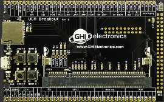

# UCM Development Options
---

These options are provided to speed the development of your product and make it possible to start programming your application within minutes without designing or building new hardware.

## UCM Dev Board

[Schematic](http://files.ghielectronics.com/downloads/Schematics/Systems/UCM%20Dev%20Board%20Rev%20E%20Schematic.pdf)

The UCM Dev Board is the fastest and easiest way to start using our Universal Compute Modules. This board provides a socket for the UCM, standard connectors for input/output, and three 40 pin socket headers for connecting peripherals and a display. Peripheral connectors include external power, Ethernet, CAN, USB host and client, RTC backup battery, DCMI interface and an SD card slot.  It also has a buzzer, LEDs, a reset button, and user programmable boot buttons.

Our display modules have mating 40 pin headers. The headers allow you to mount the display directly to the Dev Board or mount the display remotely using a standard IDE hard drive cable.
  
To start development using the UCM Dev Board, just plug a UCM into the socket on the board and connect the board to a host computer using a micro USB cable. Go to the documentation page for the particular UCM you are using ([UC2550](uc2550.md), [UC5550](uc5550.md) or [G400D](g400d.md)) for instructions on loading the latest bootloader and firmware and setting up your host computer. Then, start programming!

## UCM Breakout Board

[Schematic](http://files.ghielectronics.com/downloads/Schematics/Systems/UCM%20Breakout%20Rev%20C%20Schematic.pdf)

The UCM Breakout Board provides a socket for UCMs, and both through hole and surface mount edge connections for soldering the Breakout Board to your own circuit board. You can solder pin headers to the Breakout Board and use traditional breadboarding techniques to build your prototype as well.

The breakout board also provides a reset button, four user programmable boot buttons, and a micro SD card slot. This board makes it easier to use UCMs in prototypes or products without the need to solder the fine pitch 200 pin SO-DIMM socket.

The Breakout Board also provides a USB connector for connecting to a host computer. It does not, however, have a 3.3 volt regulator. 5 volts from the USB connector is available on a pad on the board (5V USB). You can wire your own regulator between this pad and the 3V3 pad to power this board over USB. These pads and a ground (GND) pad are conveniently located in close proximity at one corner of the board (see picture below).

To get started using the Through Hole Module, it is only necessary to provide a 3.3 volt source and connect the module to a host computer using a micro USB cable. Then update your device with the latest bootloader and firmware and start coding! Go to the documentation page for the particular UCM you are using ([UC2550](uc2550.md), [UC5550](uc5550.md) or [G400D](g400d.md)) for instructions on loading the latest bootloader and firmware and setting up your host computer.

## Displays

These display boards are designed for use with the UCM Dev Board and UCM Breakout Board. They have a 40 pin male header connector that mates with the UCM Dev and Breakout boards directly or through a standard 40 pin IDE hard drive cable. If you want to mount the display board directly to the dev board, matching mounting holes are provided.

To see sample code used to write to these displays please visit the [Parallel TFT Displays](../../software/tinyclr/tutorials/display.md#parallel-tft-displays) section of our TinyCLR tutorials.

### UD435

[Schematic](http://files.ghielectronics.com/downloads/Schematics/Systems/UD435%20Rev%20A%20Schematic.pdf)

Display Module: ER-TFT043-3

The UD435 supports either a 4.3 inch or 5 inch capacitive LCD touch screen.

### UD700

[Schematic](http://files.ghielectronics.com/downloads/Schematics/Systems/UD700%20Rev%20A%20Schematic.pdf)

Display Module: ER-TFT070-4

The UD700 supports a 7 inch capacitive LCD touch screen.

***

Need a solution for harsh or high vibration environments? Check out our [**SCMs**](../scm/intro.md).

You can also visit our main website at [**www.ghielectronics.com**](http://www.ghielectronics.com) and our community forums at [**forums.ghielectronics.com**](https://forums.ghielectronics.com/).