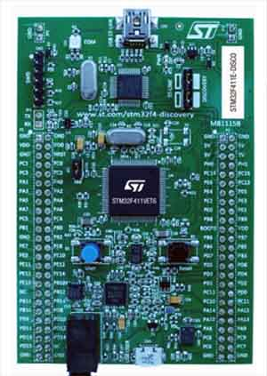

# STM32 Boards
The market is full of STM32 boards -- especially from ST Microelectronics.  ST offers several evaluation boards for their STM32 product families. The FEZCLR reference firmware runs on the STM32F4 family of processors, which is their most popular.

# STM32F4 Discovery

The ST Microelectronics [STM32F411 Discovery board](http://www.st.com/en/evaluation-tools/32f411ediscovery.html) works with the FEZCLR firmware. Follow the instructions for [Uploading DFU Files](../loaders/stm32_bootloader.md#uploading-dfu-files) to load the bootloader. To load the TinyCLR firmware please go to the [Loading the Firmware](../loaders/ghi_bootloader.md#loading-the-firmware) section of the GHI bootloader page.

# STM32F4 Nucleo

The ST Microelectronics [Nucleo-F401RE](http://www.st.com/en/evaluation-tools/nucleo-f401re.html) board works with the FEZCLR firmware. Follow the instructions for [Uploading DFU Files](../loaders/stm32_bootloader.md#uploading-dfu-files) to load the bootloader. To load the TinyCLR firmware please go to the [Loading the Firmware](../loaders/ghi_bootloader.md#loading-the-firmware) section of the GHI bootloader page.

> [!Tip]
> The Nucleo board doesn't include a USB connector but has the connections needed to add a USB connector.

Check out this [TinyCLR Fork](https://github.com/valoni/TinyCLR-Ports/tree/master/Devices/NUCLEO-F411RE) started with the FEZCLR port to create a port for [Nucleo-F411RE](http://www.st.com/en/evaluation-tools/nucleo-f411re.html). The [docs](https://github.com/valoni/TinyCLR-Ports/tree/master/Devices/NUCLEO411RET6/Helps/doc) include instructions on how to wire USB to the discovery board.

# Other STM32F4 boards
All STM32F4 microcontrollers are very similar. Any board (Discovery, Nucleo and others) with an 8Mhz crystal should simply run the FEZCLR firmware. However, you can simply change the crystal clock in the port and recompile the firmware. Start [porting](../porting/intro.md) TinyCLR OS now.

***

Visit our main website at [**www.ghielectronics.com**](http://www.ghielectronics.com) and our community forums at [**forums.ghielectronics.com**](https://forums.ghielectronics.com/).