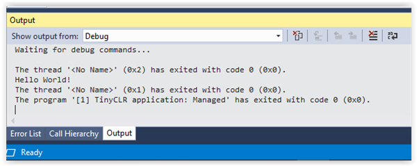

# Getting Started
---

This page explains how to set up the TinyCLR programming environment.  It covers device and computer setup and deployment of a "hello world" program.
> [!Tip]
> If you're an existing user of NETMF and still want to use it in addition to TinyCLR OS, don't worry. TinyCLR is completely independent of NETMF and works side-by-side with no issues.

## TinyCLR Device Setup
To use TinyCLR with a device you must first install the latest versions of the GHI bootloader and TinyCLR firmware on the device.  The bootloader is installed first and provides a way to install the firmware and to execute programs which are uploaded to the device.

The TinyCLR firmware includes the Common Language Runtime (CLR) which converts compiled code into machine instructions and manages program execution.  The TinyCLR firmware is also responsible for interacting with Microsoft Visual Studio to load and debug your application programs.

Instructions for installing the bootloader and firmware are provided on the documentation page for each device.  If you want to use your own device, visit our [porting guide](porting/intro.md) for information on how to get started.

## TinyCLR Computer Setup
### Download and Install Visual Studio and the TinyCLR Extension
1. If you don't already have Visual Studio 2017, download and install the free version from here:  [Visual Studio Community 2017](https://www.visualstudio.com/downloads/).
2. Make sure to select the `.NET desktop development` workload when installing Visual Studio.
3. Download and install the newest [TinyCLR Visual Studio Project System](downloads.md#visual-studio-project-system).

### Download and Install the TinyCLR Nuget Packages

1. Since TinyCLR OS is still so new, we haven't yet uploaded any packages to NuGet.  Download the newest [libraries](downloads.md#libraries), extract the archive, and place them in a [local NuGet feed](https://docs.nuget.org/ndocs/hosting-packages/local-feeds).
2. Connect your device to your PC using a USB cable (make sure your device has the latest firmware installed).
3. Start Visual Studio and create a new `TinyCLR Application` under `C# > TinyCLR`. New to Visual Studio or C#? Take a look at the [getting started guide from Microsoft](https://docs.microsoft.com/en-us/dotnet/csharp/getting-started/with-visual-studio).
4. Right click on your Project in the Solution Explorer and select `Manage NuGet Packages`.  If the Solution Explorer window is not visible, open it by selecting `Solution Explorer' in the 'View' menu.

5. Select the `Package Source` settings icon. 
 

6. Click the `+` button to add a new Package source. 

7. Select the location where the NuGet packages are stored locally by pressing the `...` button. 

8. After Selecting the local folder where the downloaded NuGet packages are, you can select the `Installed` Tab to view the installed NuGet Packages. 

9. Selecting the `Browse` tab will show all the NuGet packages located in your local NuGet feed. Those installed are noted with a green check mark in front of the name. 

10. To install one of the packages click on the package name, click the check box to the right under "Version(s)," and click on the `Install` button.

11. Accept the licensing agreement to install the package.

And, that's it! You're now ready to start programming using TinyCLR OS.

## Starting a New Project

Let's make a "hello world" program and deploy it on the FEZ Cobra III.

Open Visual Studio and select `File > New > Project`. 

There should be a `TinyCLR` option under `Visual C#`.  Click on `TinyCLR` in the left panel, and `TinyCLR Application` in the center panel.  Name the project and hit the `OK` button to create a new project. 

The project will have a single C# file named `Program.cs` whose contents are shown below.

C# source files are listed in the `Solution Explorer` window.  If the `Solution Explorer` window is not visible, click on `View > Solution Explorer` to open it.

If you right click on the project name in the Solution Explorer window a drop down menu will appear.  Select `Manage NuGet Packages...` from the menu.

 

Now you should see the installed TinyCLR NuGet library (GHIElectronics.TinyCLR.Core).  This is the only library we will need for our "hello world" program.

Close the `NuGet...` tab or click on the `Program.cs` tab to edit the source code.  Change the contents as shown below.

Make sure your device is plugged into the computer's USB port.  Now hit the start button as shown on the above image (or hit the `F5` key).  If you've done everything correctly the program will compile and deploy to your device.  The message "Hello World!" should appear in the output window as shown below.

Congratulations!  You're on your way to becoming a TinyCLR embedded developer!

***

To learn more about TinyCLR embedded programming check out our [**tutorials**](tutorials/intro.md).

You can also visit our main website at [**www.ghielectronics.com**](http://www.ghielectronics.com) and our community forums at [**forums.ghielectronics.com**](https://forums.ghielectronics.com/).