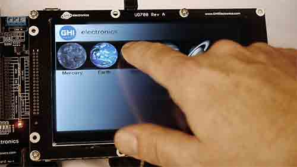

# Touch Screen
---

# Introduction
Displays may optionally include a touch sensitive screen to detect user touch input. Touch Screens can be resistive or capacitive.




# Resistive Touch

A resistive touch measures the resistance across X and Y to determine the touch position. While it is possible to use GPIO and ADC, it is better to use dedicated chips. The only advantage of resistive touch over capacitive is that they work through pressure, meaning you can use it while wearing gloves. Resistive touch is not very accurate and requires calibration.

Unless you have specific reason to use resistive touch, a capacitive touch should be used.

# Capacitive Touch

Capacitive Touch screens are used on most modern devices, including phones. They are very accurate and capable of detecting multiple simultaneous touches.

A special capacitive controller chip must be used to control the touch panel. This chip is usually mounted right on the flat cable going to the touch panel. These chips are usually I2C or SPI interface, with I2C being more common.

The capacitive displays used in our development options use a controller from FocalTech.

Add this sample driver to your project. The constructor simply needs to know which I2C bus and reset pin are being used. The event fires with exact position matching the display resolution, no need for any scaling or calibration.

```cs
using System;
using GHIElectronics.TinyCLR.Devices.Gpio;
using GHIElectronics.TinyCLR.Devices.I2c;

namespace GHIElectronics.TinyCLR.Drivers.FocalTech.FT5xx6 {
    public class TouchEventArgs : EventArgs {
        public int X { get; }
        public int Y { get; }

        public TouchEventArgs(int x, int y) {
            this.X = x;
            this.Y = y;
        }
    }

    public delegate void TouchEventHandler(FT5xx6Controller sender, TouchEventArgs e);

    public class FT5xx6Controller : IDisposable {
        private readonly byte[] addressBuffer = new byte[1];
        private readonly byte[] read4 = new byte[4];
        private readonly byte[] read1 = new byte[1];
        private readonly I2cDevice i2c;
        private readonly GpioPin interrupt;

        public event TouchEventHandler TouchDown;
        public event TouchEventHandler TouchUp;
        public event TouchEventHandler TouchMove;

        public static I2cConnectionSettings GetConnectionSettings() => new I2cConnectionSettings(0x38) {
            BusSpeed = I2cBusSpeed.FastMode,
            AddressFormat = I2cAddressFormat.SevenBit,
        };

        public FT5xx6Controller(I2cDevice i2c, GpioPin interrupt) {
            this.i2c = i2c;

            this.interrupt = interrupt;
            this.interrupt.SetDriveMode(GpioPinDriveMode.Input);
            this.interrupt.DebounceTimeout = TimeSpan.FromMilliseconds(1);
            this.interrupt.ValueChangedEdge = GpioPinEdge.FallingEdge;
            this.interrupt.ValueChanged += this.OnInterrupt;
        }

        public void Dispose() {
            this.i2c.Dispose();
            this.interrupt.Dispose();
        }

        private void OnInterrupt(GpioPin sender, GpioPinValueChangedEventArgs e) {
            var points = this.ReadData(2, this.read1)[0];

            for (var i = 0; i < points; i++) {
                var data = this.ReadData(i * 6 + 3, this.read4);
                var flag = (data[0] & 0xC0) >> 6;
                var x = ((data[0] & 0x0F) << 8) | data[1];
                var y = ((data[2] & 0x0F) << 8) | data[3];

                (flag == 0 ? this.TouchDown : flag == 1 ? this.TouchUp : flag == 2 ? this.TouchMove : null)?.Invoke(this, new TouchEventArgs(x, y));
            }
        }

        private byte[] ReadData(int address, byte[] buffer) {
            this.addressBuffer[0] = (byte)address;

            this.i2c.WriteRead(this.addressBuffer, buffer);

            return buffer;
        }
    }
}
```

This basics example will draw a dot on touch move
```cs
var touch = new FT5xx6Controller(i2cController.GetDevice(FT5xx6Controller.GetConnectionSettings()), gpioController.OpenPin(UCMStandard.GpioPin.B));
touch.TouchMove += (_, e) => {
    screen.FillEllipse(brush, e.X, e.Y, 5, 5);
    screen.Flush();
};
```
