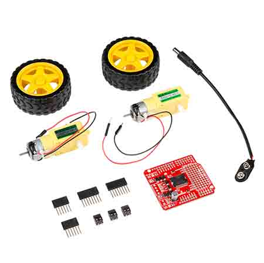

# Sparkfun Ardumoto Shield Kit
 

The sparkfun [Sparkfun Ardumoto Shield Kit](https://www.sparkfun.com/products/14180) is a low cost way of building a robot, somewhat quickly.


Plug the shield on top of your [FEZ](../../hardware/products/fez.md), or any other Arduino-pinout compatible board.

You are now ready for some serious dancing!

```
public static void Main()
{
    var GPIO = GpioController.GetDefault();
    var DIRA = GPIO.OpenPin(FEZ.GpioPin.D2);
    var DIRB = GPIO.OpenPin(FEZ.GpioPin.D4);
    DIRA.SetDriveMode(GpioPinDriveMode.Output);
    DIRB.SetDriveMode(GpioPinDriveMode.Output);

    var PWM1 = PwmController.FromId(FEZ.PwmPin.Controller1.Id);
    var PWM3 = PwmController.FromId(FEZ.PwmPin.Controller3.Id);
    PWM1.SetDesiredFrequency(5000);
    PWM3.SetDesiredFrequency(5000);

    var PWMA = PWM1.OpenPin(FEZ.PwmPin.Controller1.D3);
    var PWMB = PWM3.OpenPin(FEZ.PwmPin.Controller3.D11);
    PWMA.Start();
    PWMB.Start();
    // reverse direction every one second!
    // Do not foget the shield needs power. Thsi can come from VIN, meaning plug a power pack into your *duino board.
    PWMB.SetActiveDutyCyclePercentage(0.9);
    while (true)
    {

        DIRA.Write(GpioPinValue.High);
        DIRB.Write(GpioPinValue.High);
        System.Threading.Thread.Sleep(1000);

        //change speed 
        PWMA.SetActiveDutyCyclePercentage(0.9);

        DIRA.Write(GpioPinValue.Low);
        DIRB.Write(GpioPinValue.Low);
        System.Threading.Thread.Sleep(1000);

        //change speed 
        PWMA.SetActiveDutyCyclePercentage(0.5);
    }
}
```