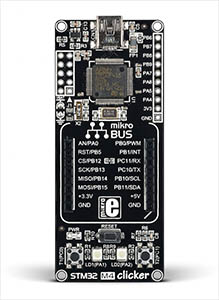

# Clicker
The Clicker board from Mikro Elekronika, and other similar products listed on this page, all run TinyCLR OS. You wil load TinyCLR OS on these boards using the [Mikro bootloader](../../hardware/loaders/mikro_bootloader.html). 

> [!Tip]
> The loader will wait for a few seconds on every power up before it runs TinyCLR OS. If this delay is not desirable, use an ST-Link programmer to flash the firmware onto the board directly, overwriting the bootloader.

 
Mikro Elekronika's [STM32 M4 Clicker](https://shop.mikroe.com/clicker-stm32f4) board includes a single [mikroBUS](https://www.mikroe.com/mikrobus/) socket, for quickly adding one of many available [click modules](../accessories/mikroelectronika_click.html).

The TinyCLR OS [Clicker firmware file](where is it?)

> [!Warning]
> Clicker and Clicker 2 boards use different processors and different system clock. Each board has its own TinyCLR OS firmware.

# Clicker 2

Mikro Elekronika's [cicker 2 for STM32](https://shop.mikroe.com/clicker-2-stm32f4) board includes dual [mikroBUS](https://www.mikroe.com/mikrobus/) socket, for quickly adding one of many available [click modules](../accessories/mikroelectronika_click.html).

The TinyCLR OS [Clicker 2 firmware file](where is it?)

> [!Warning]
> Clicker and Clicker 2 boards use different processors and different system clock. Each board has its own TinyCLR OS firmware.

# MINI-M4 for STM32
The [MINI-M4 for STM32](https://shop.mikroe.com/mini-stm32f4) uses the same processor and system clock as the Clicker board (not Clicker 2).

# Buggy
[Buggy](https://shop.mikroe.com/buggy) is a robot rover platform that is expandable through the [click modules](../accessories/mikroelectronika_click.html). The Clicker 2 is used to drive this rover, making it a TinyCLR OS rover!
