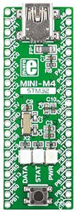
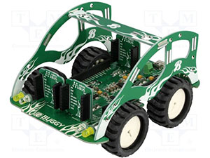
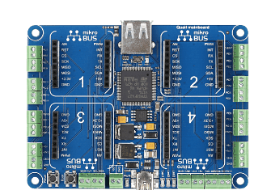

# MikroElektronika
MikroElektronika offers multiple boards that are suited for TinyCLR OS. We offer pre-compiled firmware for a few of their products.

Clicker/Clicker 2 and related boards ship with the [Mikro bootloader](../../tinyclr/loaders/intro.md#mikro-bootloader) pre installed. Use it to load the TinyCLR OS firmware.

> [!Tip]
> The loader will wait for a few seconds on every power up before it runs TinyCLR OS. If this delay is not desirable, use an ST-Link programmer to flash the firmware onto the board directly, overwriting the bootloader.

# Clicker
 

MikroElekronika's [STM32 M4 Clicker](https://shop.mikroe.com/clicker-stm32f4) board includes a single [mikroBUS](https://www.mikroe.com/mikrobus/) socket, for quickly adding one of many available [click modules](../../fez/accessories.md#mikroelektronika-arduino-uno-click-shield).

The TinyCLR OS [Clicker firmware](../downloads.md#clicker).

> [!Warning]
> Clicker and Clicker 2 boards use different processors and a different system clock. Each board has its own TinyCLR OS firmware.

# Clicker 2
 

MikroElekronika's [clicker 2 for STM32](https://shop.mikroe.com/clicker-2-stm32f4) board includes dual [mikroBUS](https://www.mikroe.com/mikrobus/) sockets, for adding many available [click modules](../../fez/accessories.md#mikroelektronika-arduino-uno-click-shield).

The TinyCLR OS [Clicker 2 firmware](../downloads.md#clicker-2).

# MINI-M4 for STM32
 

The [MINI-M4 for STM32](https://shop.mikroe.com/mini-stm32f4) uses the same processor and system clock as the Clicker board. Use the TinyCLR OS [Clicker firmware](../downloads.md#clicker).

# Buggy
 

[Buggy](https://shop.mikroe.com/buggy) is a robot rover platform that is expandable through the [click modules](../../fez/accessories.md#mikroelektronika-arduino-uno-click-shield). The Clicker 2 is used to drive this rover, making it a TinyCLR OS rover!

# Quail

Originally a .NET Micro Framework product, the Quail board brings the option of using hundreds of plug-and-play sensors and control modules, thanks to Mikro's [click modules](../../fez/accessories.md#mikroelektronika-arduino-uno-click-shield). 

Learn more about Quail at:  
https://www.mikrobusnet.org/ and https://shop.mikroe.com/quail  

The Quail firmware is located [here](../downloads.md#quail). To enter the DFU mode, press and hold the Boot button down while pressing and releasing the Reset button. Now, follow the instructions on the [STM32 bootloader](../../tinyclr/loaders/stm32_bootloader.md) page to generate and load a DFU firmware file.

When done, your PC should detect a TinyCLR device. You are now ready to [start coding](../tutorials/intro.md)

> [!Tip]
>The region set aside for RLI is 0x2002F000 - 0x2002FFF8

***

Visit our main website at [**www.ghielectronics.com**](http://www.ghielectronics.com) and our community forums at [**forums.ghielectronics.com**](https://forums.ghielectronics.com/).