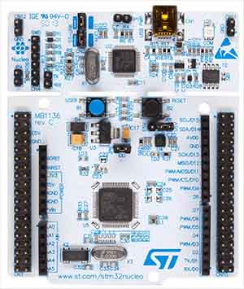

# STM32 Boards
The market is full of STM32 boards, especially the ones from ST Microelectronics, who offers several evaluation boards for their STM32 product families. The STM32F4 is the most popular family and it is what the FEZCLR reference firmware use.

# STM32F4 Discovery

The ST Microelectronics [STM32F411 Discovery board](http://www.st.com/en/evaluation-tools/32f411ediscovery.html) board works with the FEZCLR firmware. Simply, follow the [FEZ board](fez.md) instructions.

# STM32F4 Nucleo

The ST Microelectronics [Nucleo-F401RE](http://www.st.com/en/evaluation-tools/nucleo-f401re.html) board works with the FEZCLR firmware. Simply, follow the [FEZ board](fez.md) instructions.

> [!Tip]
> The Nucleo board doesn't include a USB connector by default but has the needed connections needed to add a USB connector.

See this [TinyCLR Fork](https://github.com/valoni/TinyCLR-Ports/tree/master/Devices/NUCLEO411RET6) started with the FEZCLR port to create a port for [Nucleo-F411RE](http://www.st.com/en/evaluation-tools/nucleo-f411re.html) port. The [docs](https://github.com/valoni/TinyCLR-Ports/tree/master/Devices/NUCLEO411RET6/Helps/doc) include instructions on how to wire USB to the discovery board.

# Other STM32F4 boards
All STM32F4 microcontrollers are very similar. Any board (Discovery, Nucleo and others) with an 8Mhz crystal should simply run the FEZCLR firmware. However, you can simply change the crystal clock in the port and recompile the firmware. Start [porting](../porting/intro.md) TinyCLR OS now.

