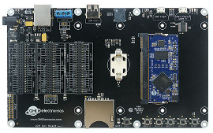

# UCM Development Options
---

Our UCM development options are provided to speed the development of your product.  These accessories make it possible to start programming your application within minutes without designing or building new hardware.

## UCM Dev Board

Our UCM Dev Board is the fastest and easiest way to start using our UCMs.  This board provides a socket for the UCM, standard connectors for input/output, and three 40 pin socket headers for connecting to peripherals and a display.  Our display modules have mating 40 pin headers.  This allows you to mount the display directly to the Dev Board or mount the display remotely using a standard IDE hard drive cable.
  
## UCM Breakout Board

Our UCM Breakout Board provides a socket for our standard UCMs, and both through hole and surface mount edge connections for soldering the Breakout Board to your own circuit board.  This board makes it easier to use our UCMs in prototypes or products without the need to solder the fine pitch 200 pin SO-DIMM socket to your board.

You can also solder pin headers to the Breakout Board and use traditional breadboarding techniques to build your prototype.

## UD435

The UD435 supports either a 4.3 inch or 5 inch capacitive LCD touch screen and is designed for use with our UCM Dev Boards and UCM Breakout Boards.  It has a 40 pin male header connector that can be plugged directly into the UCM Breakout Board or connected using a standard 40 pin IDE hard drive cable.

## UD700

The UD700 supports a 7 inch capacitive LCD touch screen and is designed for use with the UCM Dev Boards or UCM Breakout Boards.  It has a 40 pin male header connector that can be plugged directly into the UCM Breakout Board or connected using a standard 40 pin IDE hard drive cable.

***

Need a solution for harsh or high vibration environments?  Check out our [**SCMs**](../scm/intro.md).

You can also visit our main website at [**www.ghielectronics.com**](http://www.ghielectronics.com) and our community forums at [**forums.ghielectronics.com**](https://forums.ghielectronics.com/).